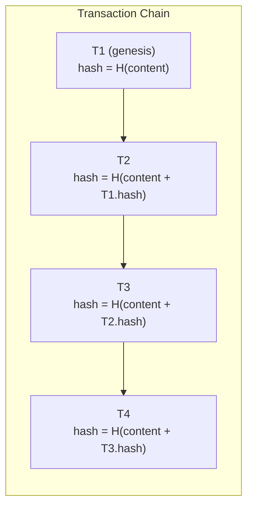
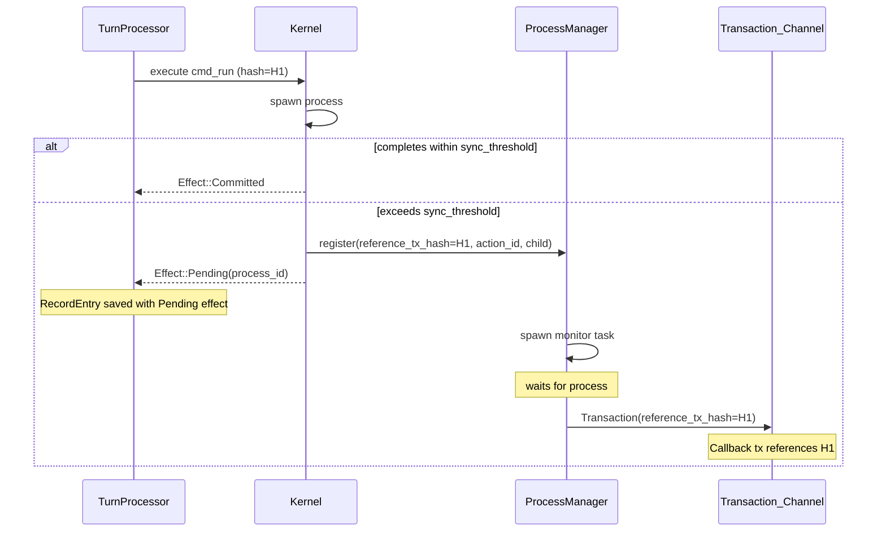
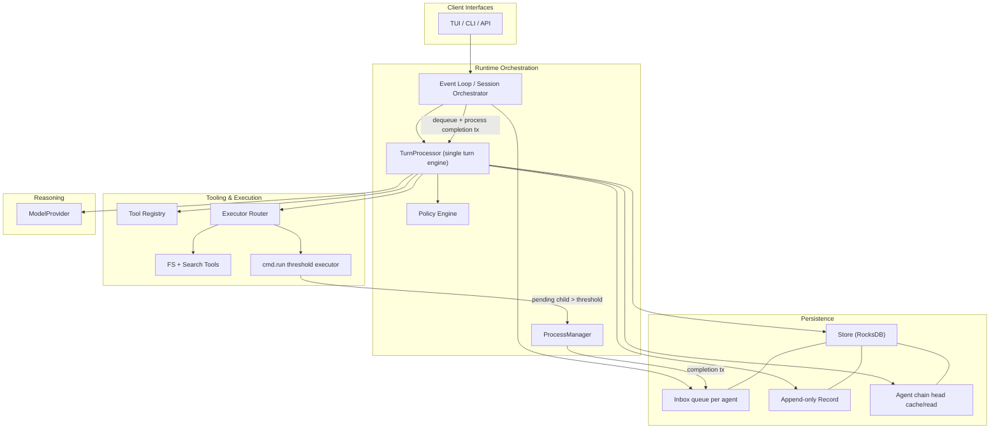
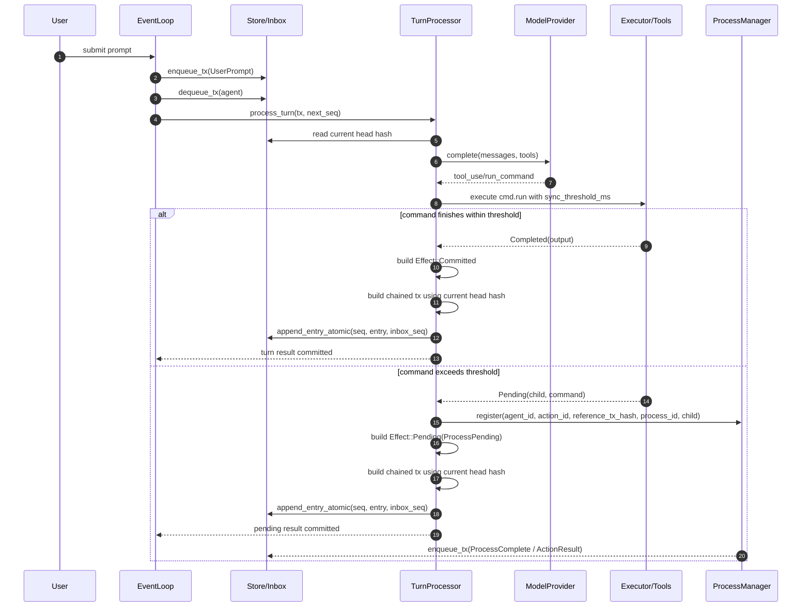
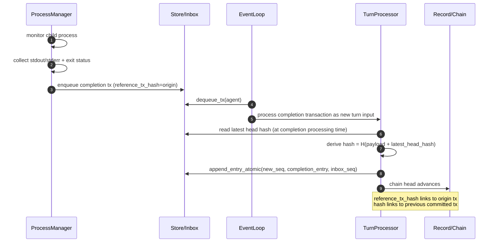
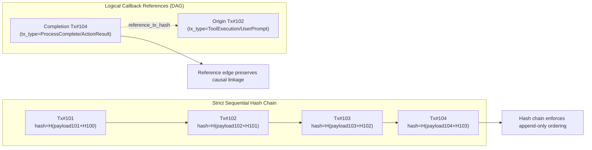
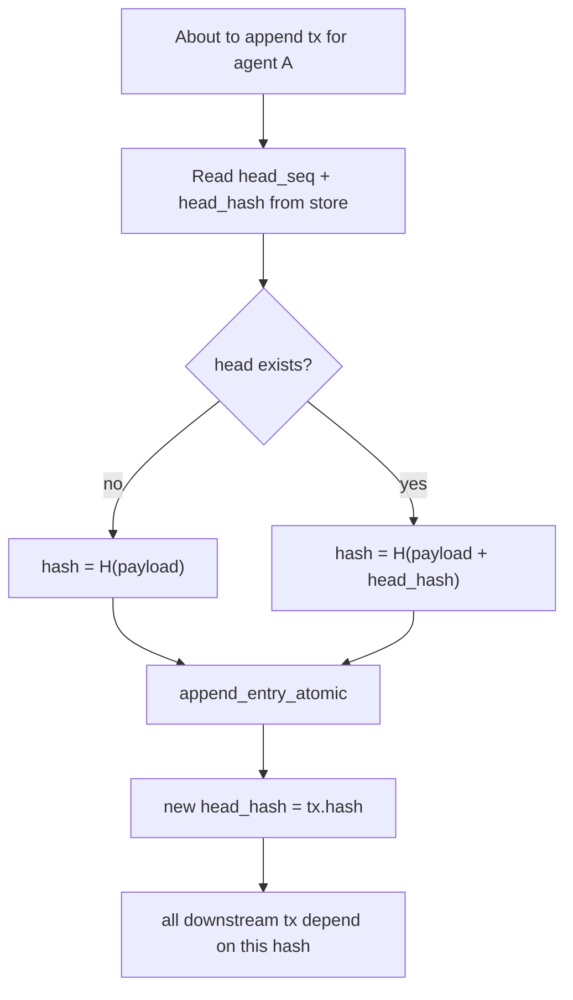

# Async Process Management with Transaction Chaining

## Core Architectural Principle

Agent records are **pure, atomic, immutable, and append-only**. The Transaction model enforces this via:

1. **Hash Chain** - The `hash` is derived from content + previous transaction's hash, creating a cryptographic chain like a blockchain. Modifying any past transaction breaks the chain.
2. **Reference Linkage** (`reference_tx_hash`) - Callback transactions (async tool results) reference their originating transaction, creating a DAG for logical relationships.

## Transaction Model

```rust
pub struct Transaction {
    /// Unique hash derived from content + previous tx hash (blockchain-style)
    pub hash: Hash,
    pub agent_id: AgentId,
    pub ts_ms: u64,
    pub tx_type: TransactionType,
    #[serde(with = "bytes_serde")]
    pub payload: Bytes,
    /// Optional reference to a related transaction (for callbacks from tools/processes)
    #[serde(default, skip_serializing_if = "Option::is_none")]
    pub reference_tx_hash: Option<Hash>,
}

pub enum TransactionType {
    UserPrompt,      // User-initiated prompt/message
    AgentMsg,        // Message from another agent
    Trigger,         // Scheduled or event-based trigger
    ActionResult,    // Result from a previously executed action
    System,          // System-generated transaction
    SessionStart,    // Session/context reset marker
    ToolProposal,    // Tool suggestion from LLM (before policy)
    ToolExecution,   // Tool result (after policy decision)
}
```

**Key design:**

- `hash` - Derived from `hash(content + prev_tx_hash)`. The chain is implicit in the derivation. Genesis tx uses `hash(content)` with no prior.
- `tx_type` - Categorizes the transaction (renamed from `kind`/`TransactionKind`)
- `reference_tx_hash` - Optional logical link to a related transaction. Only used by tools/processes for callbacks.

## Hash Chain Model




The chain is **implicit** in the hash derivation. Modifying T2 would:

1. Change T2.hash
2. Which changes T3's input (content + T2.hash)
3. Which changes T3.hash
4. Breaking all downstream references

**Hash computation:**

```rust
impl Hash {
    /// Create hash from content and previous transaction's hash.
    /// Genesis transaction passes None for prev_hash.
    pub fn from_content_chained(content: &[u8], prev_hash: Option<&Hash>) -> Self {
        let mut hasher = blake3::Hasher::new();
        hasher.update(content);
        if let Some(prev) = prev_hash {
            hasher.update(prev.as_bytes());
        }
        let hash = hasher.finalize();
        Self(*hash.as_bytes())
    }
}
```

Note: `Hash` is a 32-byte array wrapper (full blake3 output), replacing the 16-byte `TxId`.

## Design




## End-State Control Flow and Architecture (Detailed)

The target design at completion uses a single deterministic transaction pipeline, with async process completion as a first-class transaction source. Every persisted transaction must be chained to the latest head hash at commit time.

### 1) Runtime Component Topology




### 2) End-to-End Turn Flow (Sync + Async Branch)




### 3) Async Completion Ingestion and Continuation Flow




### 4) Hash Chain + Reference DAG (Orthogonal Guarantees)




### 5) Commit-Time Hashing Contract (Non-Negotiable)




This contract applies equally to:

- user prompt transactions
- assistant/agent message transactions
- tool proposal/execution transactions
- async completion transactions

## Async Process Chaining Example

**Original RecordEntry (seq=N) - starts a long-running process:**

```rust
RecordEntry {
    seq: N,
    tx: Transaction {
        hash: Hash("abc123..."),  // H(content + prev_tx.hash)
        tx_type: TransactionType::UserPrompt,
        reference_tx_hash: None,  // Top-level transaction (no callback reference)
        ...
    },
    effects: [
        Effect {
            action_id: "action-abc",
            status: Pending,
            payload: ProcessPending { 
                process_id: "proc-xyz",
                command: "cargo build --release",
            }
        }
    ]
}
```

**Completion RecordEntry (seq=N+M) - process finished:**

```rust
RecordEntry {
    seq: N + M,
    tx: Transaction {
        hash: Hash("def456..."),  // H(content + prev_tx.hash) - chain continues
        tx_type: TransactionType::ActionResult,
        reference_tx_hash: Some(Hash("abc123...")),  // Links to originating tx!
        payload: ActionResultPayload { ... }
    },
    effects: [Effect::committed_agreement(...)]
}
```

**Two orthogonal concepts:**

- `hash` - Sequential chain (implicit in derivation). Every tx depends on previous tx.
- `reference_tx_hash` - Logical link for callbacks. Only used by tools/processes.

## Changes Required

### 1. Update Transaction with hash and reference_tx_hash ([aura-core/src/types.rs](aura-core/src/types.rs))

Rename `tx_id` to `hash`, `kind` to `tx_type`, `TransactionKind` to `TransactionType`, and add `reference_tx_hash`:

```rust
pub struct Transaction {
    /// Unique hash derived from content + previous tx hash (blockchain-style)
    #[serde(with = "hex_hash")]
    pub hash: Hash,
    pub agent_id: AgentId,
    pub ts_ms: u64,
    pub tx_type: TransactionType,
    #[serde(with = "bytes_serde")]
    pub payload: Bytes,
    /// Optional reference to a related transaction (for callbacks)
    #[serde(default, skip_serializing_if = "Option::is_none", with = "option_hex_hash")]
    pub reference_tx_hash: Option<Hash>,
}

/// Rename TransactionKind -> TransactionType
pub enum TransactionType {
    UserPrompt,
    AgentMsg,
    Trigger,
    ActionResult,
    System,
    SessionStart,
    ToolProposal,
    ToolExecution,
}
```

Add `Hash` type in [aura-core/src/ids.rs](aura-core/src/ids.rs) (or rename `TxId`):

```rust
/// A 32-byte blake3 hash (full output, not truncated).
#[derive(Debug, Clone, Copy, PartialEq, Eq, Hash, Serialize, Deserialize)]
pub struct Hash([u8; 32]);

impl Hash {
    /// Create hash from content and previous transaction's hash.
    /// Genesis transaction passes None for prev_hash.
    pub fn from_content_chained(content: &[u8], prev_hash: Option<&Hash>) -> Self {
        let mut hasher = blake3::Hasher::new();
        hasher.update(content);
        if let Some(prev) = prev_hash {
            hasher.update(&prev.0);
        }
        Self(*hasher.finalize().as_bytes())
    }

    pub fn as_bytes(&self) -> &[u8; 32] {
        &self.0
    }
}
```

Update transaction constructors:

```rust
impl Transaction {
    /// Create a transaction chained to a previous transaction.
    pub fn new_chained(
        agent_id: AgentId,
        tx_type: TransactionType,
        payload: impl Into<Bytes>,
        prev_hash: Option<&Hash>,
    ) -> Self { ... }

    /// Create an action result with a reference to the originating transaction.
    pub fn action_result_with_reference(
        agent_id: AgentId,
        reference_tx_hash: Hash,
        prev_hash: Option<&Hash>,
        payload: impl Into<Bytes>,
    ) -> Self { ... }
}
```

### 2. New Types in [aura-core/src/types.rs](aura-core/src/types.rs)

Add `ProcessId` to [aura-core/src/ids.rs](aura-core/src/ids.rs).

Add `ProcessPending` payload for pending effects:

```rust
/// Payload for a pending process effect.
#[derive(Debug, Clone, Serialize, Deserialize)]
pub struct ProcessPending {
    pub process_id: ProcessId,
    pub command: String,
    pub started_at_ms: u64,
}
```

Add `ActionResultPayload` for continuation transactions:

```rust
/// Payload for ActionResult transactions that chain to pending actions.
#[derive(Debug, Clone, Serialize, Deserialize)]
pub struct ActionResultPayload {
    /// The action_id this result continues
    pub action_id: ActionId,
    /// Process identifier for correlation
    pub process_id: ProcessId,
    /// The actual result
    pub result: CommandOutput,
}
```

### 3. ProcessManager in Kernel ([aura-kernel/src/process_manager.rs](aura-kernel/src/process_manager.rs))

```rust
pub struct ProcessManager {
    /// Running processes indexed by process_id
    processes: DashMap<ProcessId, RunningProcess>,
    /// Channel to send completion transactions
    tx_sender: mpsc::Sender<Transaction>,
}

pub struct RunningProcess {
    pub action_id: ActionId,
    pub agent_id: AgentId,
    pub process_id: ProcessId,
    pub reference_tx_hash: Hash,  // The originating transaction's hash
    pub command: String,
    pub started_at: Instant,
    pub handle: JoinHandle<ProcessOutput>,
}

impl ProcessManager {
    /// Register a process for async monitoring.
    /// Spawns a task that waits for completion and sends an ActionResult 
    /// transaction with reference_tx_hash set.
    pub fn register(
        &self,
        agent_id: AgentId,
        reference_tx_hash: Hash,
        action_id: ActionId,
        child: Child,
        command: String,
    );
    
    /// Poll for completed processes (non-blocking).
    pub fn poll_completions(&self) -> Vec<Transaction>;
}
```

When a process completes, the manager creates a chained transaction:

```rust
// The app provides the current chain head hash when polling completions
Transaction::action_result_with_reference(
    running.agent_id,
    running.reference_tx_hash,  // Logical link to originating tx
    current_chain_head,         // For hash derivation (from app's latest tx)
    ActionResultPayload { ... },
)
```

Note: The chain head hash must be provided at completion time (not registration time) since other transactions may have been processed in between.

### 4. Modify TurnProcessor ([aura-kernel/src/turn_processor.rs](aura-kernel/src/turn_processor.rs))

- Add `process_manager: Arc<ProcessManager>` field
- Add `sync_threshold_ms` to `TurnConfig` (default: 5000ms)
- Pass `tx.hash` to ProcessManager as `reference_tx_hash` when registering async processes
- Update tool execution to:
  - Wait up to `sync_threshold_ms` for command completion
  - If done: return `Effect::Committed` as normal
  - If not: register with ProcessManager (including reference_tx_hash), return `Effect::Pending`

### 5. Modify fs_tools ([aura-tools/src/fs_tools.rs](aura-tools/src/fs_tools.rs))

Add `wait_with_threshold()` that returns `Result<Output, Child>`:

- `Ok(Output)` - process completed within threshold
- `Err(Child)` - still running, return handle for async tracking

### 6. Wire Up in App ([src/main.rs](src/main.rs) and [aura-cli/src/session.rs](aura-cli/src/session.rs))

- Create `mpsc::channel()` for completion transactions
- Pass sender to `ProcessManager` (owned by Kernel/TurnProcessor)
- App event loop merges incoming completion transactions with user input
- Completion transactions trigger new turn processing

## Testing Plan

### Unit Tests

#### aura-core ([aura-core/src/ids.rs](aura-core/src/ids.rs), [aura-core/src/types.rs](aura-core/src/types.rs))

- **Hash type tests**
  - `test_hash_genesis` - Genesis hash (no prev) is deterministic
  - `test_hash_chaining` - Same content + different prev_hash produces different hash
  - `test_hash_chain_integrity` - Modifying middle tx changes all downstream hashes
  - `test_hash_serialization` - Hex serialization roundtrip
- **Transaction tests**
  - `test_transaction_new_chained` - Constructor sets hash correctly
  - `test_transaction_with_reference` - reference_tx_hash is set correctly
  - `test_transaction_serialization` - JSON roundtrip with all new fields
  - `test_transaction_type_rename` - TransactionType enum values serialize correctly
- **ProcessPending/ActionResultPayload tests**
  - `test_process_pending_roundtrip` - Serialization roundtrip
  - `test_action_result_payload_roundtrip` - Serialization roundtrip

#### aura-kernel ([aura-kernel/src/process_manager.rs](aura-kernel/src/process_manager.rs))

- **ProcessManager tests**
  - `test_register_process` - Process is tracked after registration
  - `test_process_completion_sends_transaction` - Completion tx sent via channel
  - `test_completion_has_reference_tx_hash` - Completion tx has correct reference
  - `test_multiple_concurrent_processes` - Can track multiple processes
  - `test_process_timeout` - Long-running process doesn't block

#### aura-tools ([aura-tools/src/fs_tools.rs](aura-tools/src/fs_tools.rs))

- **wait_with_threshold tests**
  - `test_fast_command_returns_output` - Command completing within threshold returns Ok(Output)
  - `test_slow_command_returns_child` - Command exceeding threshold returns Err(Child)
  - `test_threshold_boundary` - Command completing at exactly threshold

### Integration Tests

#### Full async flow ([tests/integration/async_process.rs](tests/integration/async_process.rs))

- **End-to-end async process tests**
  - `test_sync_command_immediate_commit` - Fast command produces Effect::Committed immediately
  - `test_async_command_pending_then_complete` - Slow command produces Effect::Pending, then ActionResult tx
  - `test_async_completion_has_valid_chain` - Completion tx hash is correctly chained
  - `test_async_completion_references_original` - Completion tx.reference_tx_hash points to original
- **Transaction chain integrity tests**
  - `test_chain_verification` - Can verify entire chain by recomputing hashes
  - `test_tampered_chain_detection` - Modifying stored tx is detectable
  - `test_replay_produces_same_hashes` - Replaying transactions produces identical hashes
- **Concurrent process tests**
  - `test_multiple_async_processes` - Multiple pending processes complete correctly
  - `test_interleaved_sync_async` - Mix of sync and async commands maintains chain integrity

### Property-Based Tests ([tests/proptest_tests.rs](tests/proptest_tests.rs))

- **Hash properties**
  - `prop_hash_deterministic` - Same inputs always produce same hash
  - `prop_hash_chain_order_matters` - Different orderings produce different chains
  - `prop_hash_content_sensitive` - Any content change changes hash
- **Transaction chain properties**
  - `prop_chain_is_append_only` - Can only add to end, not modify middle
  - `prop_reference_tx_hash_valid` - reference_tx_hash always points to existing tx

## Key Benefits

- **Cryptographic integrity**: `hash` is derived from content + previous tx hash; tampering breaks the chain
- **Immutability preserved**: No record entry is ever modified
- **Simple model**: Chain is implicit in `hash` derivation, no separate field needed
- **Explicit references**: `reference_tx_hash` creates a traversable DAG for callback relationships
- **Auditability**: Full history with verifiable chain integrity
- **Replayability**: Replay all transactions in order, verify hashes match
- **Canonical naming**: `hash`, `tx_type`, `reference_tx_hash` are clear and unambiguous

