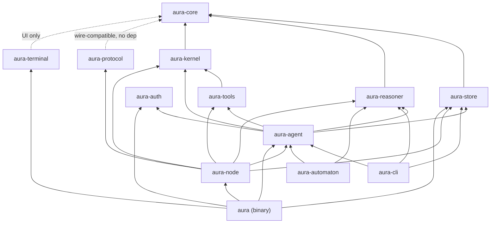
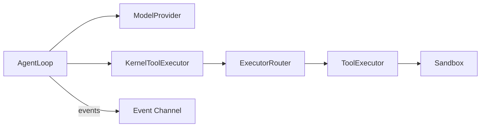
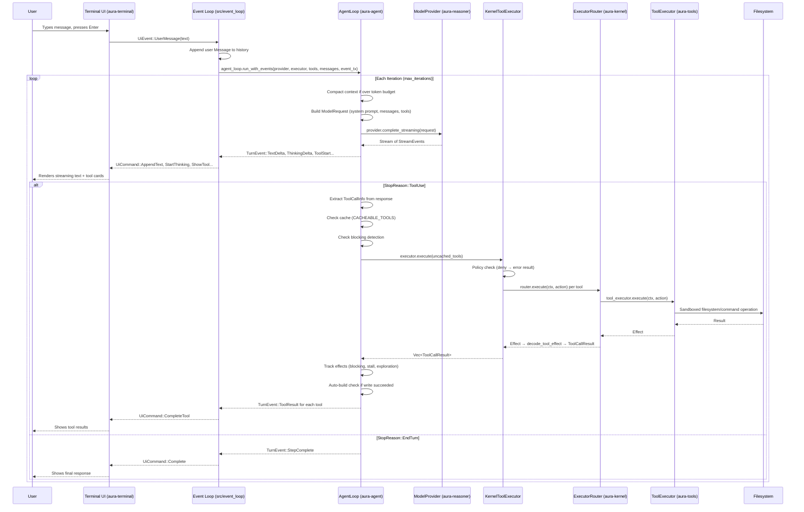
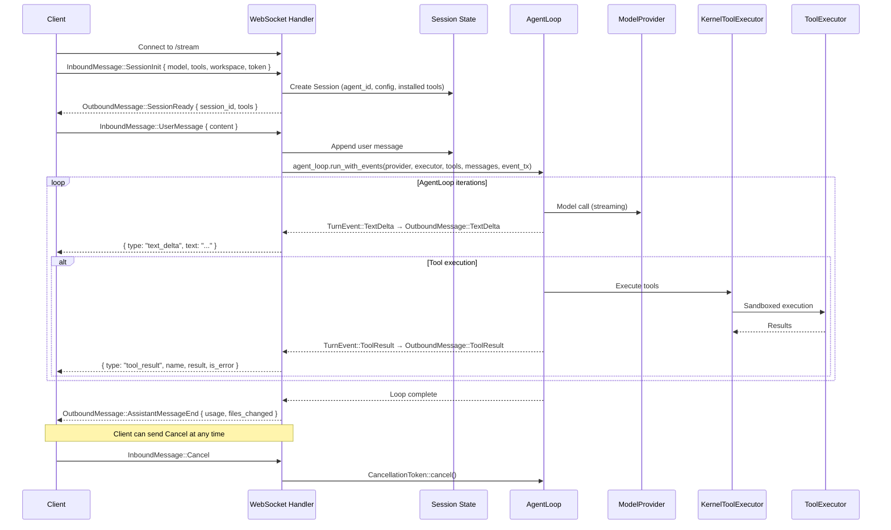
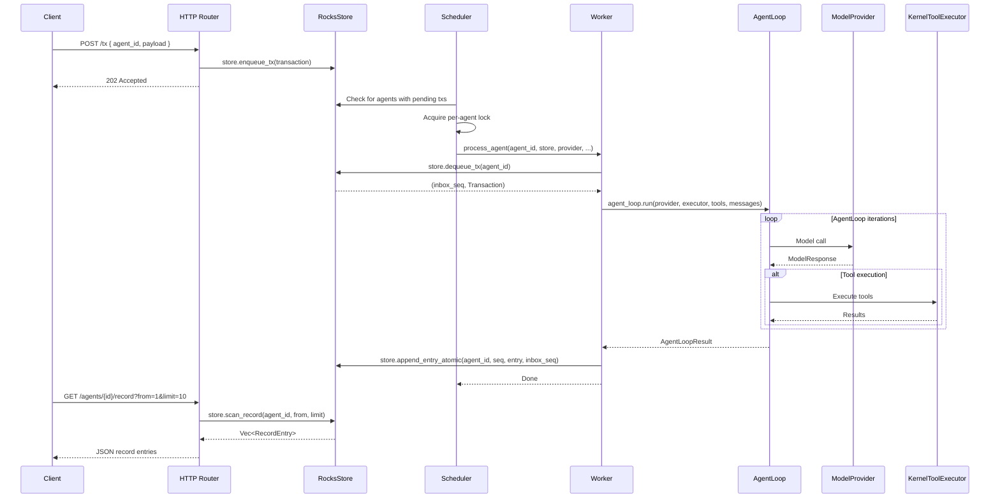
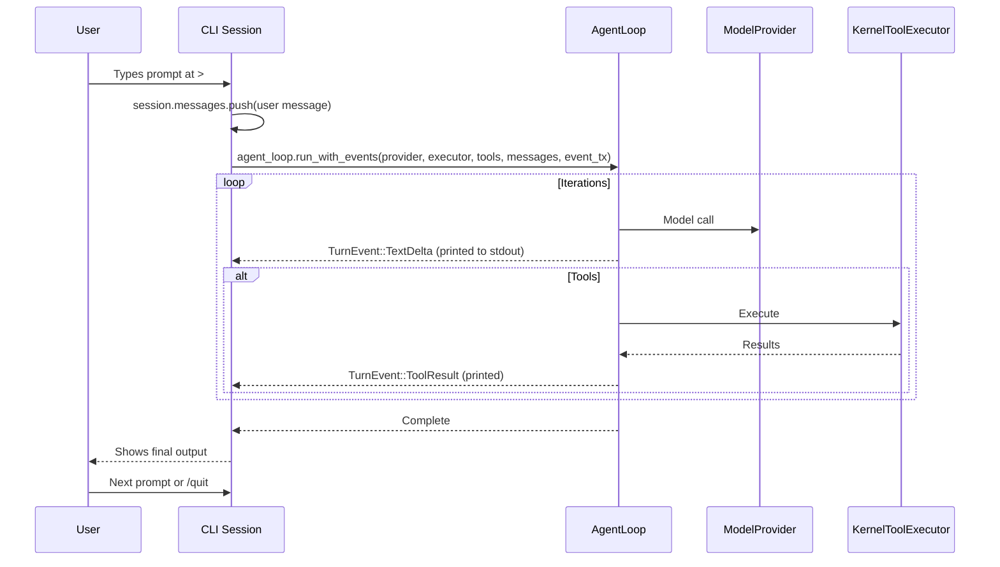
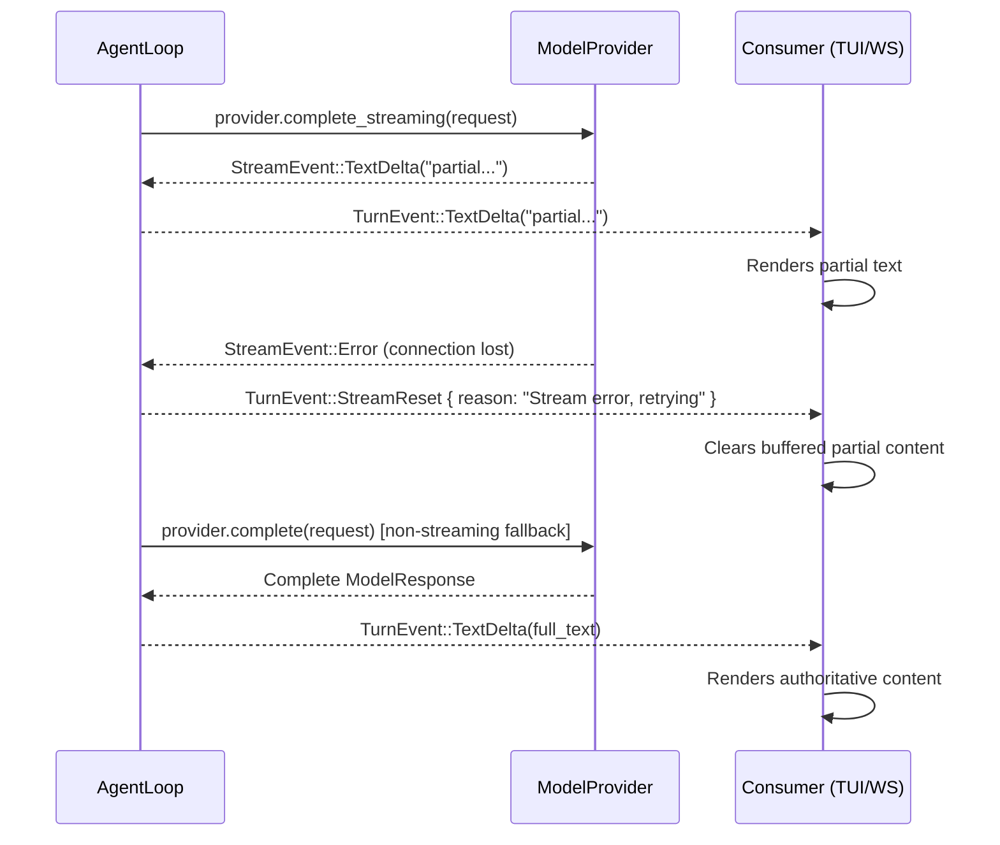
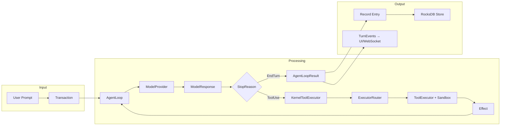

# Aura Harness — Architecture

This document describes the system architecture in two sections:

1. **Architecture** — every crate from most fundamental to least, with key types and submodules.
2. **User Flows** — how data moves through the system from the user's perspective.

---

## Part 1: Architecture

### Crate Summary

| Crate | Role |
|------|------|
| `aura-core` | Foundational domain types, IDs, hashing, and shared errors used across all crates. |
| `aura-store` | Durable RocksDB-backed storage for agent records, metadata, and inbox queues. |
| `aura-reasoner` | Model-provider abstraction for completion and streaming APIs. |
| `aura-kernel` | Deterministic execution kernel with router, policies, sandboxing, and scheduler primitives. |
| `aura-tools` | Tool catalog and built-in/external tool execution implementations. |
| `aura-agent` | Main agent orchestration loop: model calls, tool execution, streaming, budgets, and compaction. |
| `aura-protocol` | Wire-level request/response/event types for transport boundaries. |
| `aura-auth` | Auth token extraction/validation utilities for node and agent startup. |
| `aura-terminal` | Terminal UI layer and event-loop glue for interactive sessions. |
| `aura-cli` | Minimal command-line REPL over the shared agent runtime. |
| `aura-automaton` | Workflow/automation helpers that drive scripted agent behavior. |
| `aura-node` | HTTP/WebSocket server runtime, session management, and scheduler-backed processing. |
| `aura` | Root binary wiring for launch modes, runtime setup, and top-level command entrypoints. |

### Dependency Graph



Crates are described below in dependency order — most fundamental first.

---

### 1. `aura-core` — Domain Types & IDs

The foundation crate. Zero internal dependencies. Defines all shared domain types, strongly-typed identifiers, hashing, and error types used across the system.

#### Key Types

| Type | Purpose |
|------|---------|
| `AgentId` | 32-byte agent identifier (BLAKE3 or UUID-derived) |
| `TxId` | 32-byte transaction identifier (content-addressed) |
| `ActionId` | 16-byte action identifier (random) |
| `ProcessId` | 16-byte background process identifier |
| `Hash` | 32-byte BLAKE3 digest with chaining support |
| `Transaction` | Inbound work unit: `tx_id`, `agent_id`, `TransactionType`, `payload` |
| `TransactionType` | `UserPrompt`, `AgentMsg`, `SessionStart`, `System`, ... |
| `Action` | Authorized operation: `action_id`, `ActionKind`, serialized payload |
| `ActionKind` | `Propose`, `Delegate`, `Record`, `System`, ... |
| `Effect` | Result of executing an action: `EffectKind`, `EffectStatus`, payload |
| `RecordEntry` | Immutable log entry: `seq`, `tx`, `context_hash`, proposals, actions, effects |
| `ToolCall` | Tool invocation: `tool` name + `args` (JSON) |
| `ToolResult` | Tool output: `content`, `is_error`, `metadata` |
| `AuraError` | Unified error enum (storage, serialization, kernel, executor, reasoner, validation) |

#### Submodules

| Module | Contents |
|--------|----------|
| `ids` | `AgentId`, `TxId`, `ActionId`, `ProcessId`, `Hash` — macro-generated newtypes with hex serde |
| `types` | All domain structs/enums — barrel re-export from `action`, `effect`, `proposal`, `record`, `tool`, `transaction`, ... |
| `hash` | BLAKE3 helpers: `hash_bytes`, `hash_many`, `compute_context_hash`, `Hasher` |
| `error` | `AuraError` with `thiserror` and `From` impls |

---

### 2. `aura-store` — Persistent Storage

RocksDB-backed durable storage with column families for the record log, agent metadata, and transaction inbox. All mutations use `WriteBatch` for atomicity.

#### Key Types

| Type | Purpose |
|------|---------|
| `Store` (trait) | Abstract storage API: `enqueue_tx`, `dequeue_tx`, `append_entry_atomic`, `scan_record`, ... |
| `RocksStore` | `Store` implementation over RocksDB with configurable `sync_writes` |
| `StoreError` | Error enum: `RocksDb`, `SequenceMismatch`, `ColumnFamilyNotFound`, `InboxCorruption`, ... |

#### Column Families

| CF | Key Format | Purpose |
|----|-----------|---------|
| `record` | `R` + `AgentId` + `seq` (big-endian) | Append-only record log |
| `agent_meta` | `M` + `AgentId` + `MetaField` | Head sequence, inbox pointers, agent status |
| `inbox` | `Q` + `AgentId` + `inbox_seq` | Pending transaction queue |

#### Submodules

| Module | Contents |
|--------|----------|
| `store` | `Store` trait definition |
| `rocks_store` | `RocksStore` implementation, `WriteBatch` atomics |
| `keys` | `RecordKey`, `AgentMetaKey`, `InboxKey` with `KeyCodec` encoding |
| `error` | `StoreError` enum |

---

### 3. `aura-reasoner` — Model Provider Abstraction

Provider-agnostic interface for LLM completions. Defines normalized message types, streaming, and the `ModelProvider` trait. Ships with Anthropic and mock providers.

#### Key Types

| Type | Purpose |
|------|---------|
| `ModelProvider` (trait) | `complete(ModelRequest) -> ModelResponse`, `complete_streaming` → `StreamEventStream` |
| `ModelRequest` | `model`, `system`, `messages`, `tools`, `tool_choice`, `max_tokens`, `thinking`, auth headers |
| `ModelResponse` | `stop_reason`, `message`, `usage`, `trace`, `model_used` |
| `Message` | `role` (`User`/`Assistant`) + `content: Vec<ContentBlock>` |
| `ContentBlock` | `Text`, `Thinking`, `Image`, `ToolUse { id, name, input }`, `ToolResult { tool_use_id, content, is_error }` |
| `StopReason` | `EndTurn`, `ToolUse`, `MaxTokens`, `StopSequence` |
| `ToolDefinition` | Tool name + description + JSON Schema for input |
| `StreamEvent` | SSE-style events: `TextDelta`, `ThinkingDelta`, `InputJsonDelta`, `ContentBlockStart/Stop`, ... |
| `StreamAccumulator` | Folds `StreamEvent`s into a complete `ModelResponse` |
| `AnthropicProvider` | HTTP client with retry, model chain fallback, proxy/direct routing |
| `MockProvider` | Queued/canned responses for testing |

#### Submodules

| Module | Contents |
|--------|----------|
| `types/` | `Message`, `ContentBlock`, `Role`, `ModelRequest`, `ModelResponse`, `Usage`, `StopReason`, `StreamEvent`, `StreamAccumulator`, `ToolChoice`, `ToolDefinition` |
| `anthropic/` | `AnthropicProvider`, `AnthropicConfig`, `RoutingMode`, SSE parser |
| `mock` | `MockProvider`, `MockResponse` |
| `request` | `ProposeRequest`, `RecordSummary`, `ProposeLimits` (kernel propose flow) |
| `error` | `ReasonerError` |

---

### 4. `aura-kernel` — Deterministic Kernel

The invariant core. Builds context from the record, calls the reasoner, enforces policy, dispatches execution through the router, and produces `RecordEntry`s. Given the same record, produces the same output.

#### Key Types

| Type | Purpose |
|------|---------|
| `Kernel<S, R>` | End-to-end step processor: `process(tx, next_seq) -> ProcessResult` |
| `Proposer` (trait) | `propose(ProposeRequest) -> ProposalSet` — pluggable model/mock |
| `ExecutorRouter` | Routes `Action`s to the first matching `Executor` in a registry |
| `Executor` (trait) | `execute(ctx, action) -> Effect`, `can_handle(action) -> bool` |
| `ExecuteContext` | Per-action context: `agent_id`, `action_id`, `workspace_root`, `limits` |
| `ExecuteLimits` | Caps for read/write bytes, command timeout, stdout/stderr |
| `Policy` | Runtime permission engine with session approval memory |
| `PolicyConfig` | Allowed action kinds, tool allowlists, per-tool `PermissionLevel` overrides |
| `PermissionLevel` | `AlwaysAllow`, `AskOnce`, `AlwaysAsk`, `Deny` |
| `ContextBuilder` | Builds `Context` (context hash + record summaries) from transaction + record window |
| `decode_tool_effect` | Parses an `Effect` back into human-readable `DecodedToolResult` |

#### Submodules

| Module | Contents |
|--------|----------|
| `executor` | `Executor` trait, `ExecuteContext`, `ExecuteLimits`, `decode_tool_effect` |
| `router` | `ExecutorRouter` — fan-out dispatch to registered executors |
| `policy` | `Policy`, `PolicyConfig`, `PermissionLevel`, `default_tool_permission` |
| `context` | `Context`, `ContextBuilder` |
| `kernel` | `Kernel`, `KernelConfig`, `ProcessResult`, `Proposer` |

---

### 5. `aura-tools` — Tool Registry & Execution

Filesystem, command, search, and domain tools. Sandboxed execution ensures agents cannot escape their workspace. Implements the `Executor` trait from `aura-kernel`.

#### Key Types

| Type | Purpose |
|------|---------|
| `ToolRegistry` (trait) | `list() -> Vec<ToolDefinition>`, `get(name) -> Option<ToolDefinition>` |
| `DefaultToolRegistry` | HashMap-backed registry pre-loaded with builtin tools |
| `ToolExecutor` | Dispatches `ToolCall`s to registered `Tool` impls; implements `Executor` |
| `ToolResolver` | Catalog-backed visibility + optional domain executor fallback; implements `Executor` |
| `ToolCatalog` | Merged catalog of all tools with profile-based visibility (`Core`, `Agent`, `Engine`) |
| `Sandbox` | Path validation: canonicalize, prefix-check, symlink guard |
| `Tool` (trait) | `execute(ToolCall, Sandbox) -> ToolResult` — individual tool implementation |
| `ToolConfig` | Feature flags: `enable_fs`, `enable_commands`, `command_allowlist`, size limits |

#### Built-in Tools (`fs_tools/`)

| Tool | Module | Description |
|------|--------|-------------|
| `fs.ls` | `ls.rs` | Directory listing |
| `fs.read` | `read.rs` | File read with size limits |
| `fs.write` | `write.rs` | File write (creates directories) |
| `fs.edit` | `edit.rs` | Targeted string replacement in files |
| `fs.stat` | `stat.rs` | File metadata |
| `fs.find` | `find.rs` | File search by name pattern |
| `fs.delete` | `delete.rs` | File deletion |
| `search.code` | `search/` | Ripgrep-powered code search |
| `cmd.run` | `cmd/` | Shell command execution with sync/async threshold |

#### Submodules

| Module | Contents |
|--------|----------|
| `registry` | `ToolRegistry` trait, `DefaultToolRegistry` |
| `executor` | `ToolExecutor` — dispatches to `Tool` impls, builds `Sandbox` |
| `resolver` | `ToolResolver` — catalog + domain executor integration |
| `catalog` | `ToolCatalog`, `ToolProfile`, `ToolOwner` |
| `sandbox` | `Sandbox` — path confinement and validation |
| `fs_tools/` | All built-in tool implementations |
| `domain_tools` | HTTP-based external tool execution |
| `automaton_tools` | Tools available to automaton workflows |

---

### 6. `aura-agent` — Orchestration Layer

The heart of the runtime. `AgentLoop` is the **sole orchestrator** — it drives the multi-step agentic conversation loop, calling the model, executing tools, and managing streaming, blocking detection, stall detection, budget, and compaction.

#### Core Orchestration



| Type | Purpose |
|------|---------|
| `AgentLoop` | Multi-step loop: model call → tool execution → repeat until `EndTurn` or budget exhaustion |
| `AgentLoopConfig` | Tunables: `max_iterations`, `max_tokens`, `stream_timeout`, `credit_budget`, `exploration_allowance`, `system_prompt`, `model`, auth headers, `tool_hints`, thinking taper |
| `KernelToolExecutor` | Bridges `AgentToolExecutor` → `ExecutorRouter`: parallel/sequential mode, per-tool timeouts, policy deny |
| `AgentToolExecutor` (trait) | `execute(&[ToolCallInfo]) -> Vec<ToolCallResult>` + optional `auto_build_check` |
| `TurnEvent` | Unified streaming events: `TextDelta`, `ThinkingDelta`, `ToolStart`, `ToolResult`, `IterationComplete`, `StreamReset`, `Error`, ... |
| `AgentLoopResult` | Final outcome: token totals, iteration count, `stalled`/`timed_out`/`insufficient_credits` flags, messages |

#### AgentLoop Iteration

```mermaid
flowchart TD
  start([Begin Iteration]) --> compact[Compact context if needed]
  compact --> build[Build model request]
  build --> call[Call model provider]
  call --> stream{Use streaming}
  stream -->|yes| accumulate[Collect stream events into response]
  stream -->|no| direct[Run non streaming complete call]
  accumulate --> emit_iter[Emit iteration complete event]
  direct --> emit_iter
  emit_iter --> stop{Stop reason}
  stop -->|EndTurn| done([Return result])
  stop -->|MaxTokens| handle_max[Handle max tokens]
  stop -->|ToolUse| tools[Handle tool use]
  handle_max --> done
  tools --> cache_split[Split cached and uncached tools]
  cache_split --> block_check[Split blocked and executable tools]
  block_check --> execute[Execute tools]
  execute --> track[Track blocking stall and exploration]
  track --> build_check{Write succeeded}
  build_check -->|yes| auto_build[Run auto build check]
  build_check -->|no| next[Next iteration]
  auto_build --> next
  next --> start
```

#### Submodules

| Module | Contents |
|--------|----------|
| `agent_loop/` | Core loop: `mod.rs` (AgentLoop, config, state), `iteration.rs` (model calls), `streaming.rs` (event emission), `tool_execution.rs` (cache/execute/emit), `tool_processing.rs` (blocking/stall/build), `context.rs` (compaction) |
| `kernel_executor.rs` | `KernelToolExecutor` — parallel/sequential, timeout, policy |
| `events.rs` | `TurnEvent` enum (alias: `AgentLoopEvent`) |
| `types.rs` | `AgentToolExecutor` trait, `ToolCallInfo`, `ToolCallResult`, `AgentLoopResult`, `BuildBaseline` |
| `blocking/` | `detection/` (write-failure tracking, read-guard), `stall.rs` (repeated-target detection) |
| `budget.rs` | `BudgetState`, `ExplorationState` — token and exploration tracking |
| `compaction/` | Context window compression when approaching token limits |
| `build.rs` | Build output parsing and baseline annotation |
| `prompts/` | `system/` (system prompt generation), `fix/` (error recovery prompts), `context.rs` |
| `verify/` | Build verification runner, error signatures, test baseline capture |
| `runtime/process_manager/` | `ProcessManager` — background process tracking with completion callbacks |
| `session_bootstrap.rs` | `resolve_store_path`, `open_store`, `build_tool_executor`, `select_provider`, `load_auth_token` |
| `sanitize.rs` | Message sanitization (malformed tool_use/tool_result repair) |
| `read_guard.rs` | Tracks which files have been read (full vs range) to prevent redundant reads |
| `helpers.rs` | `is_write_tool`, `is_exploration_tool`, `append_warning` |
| `policy.rs` | Agent-level policy checks |
| `planning.rs` | Plan detection and handling |
| `shell_parse.rs` | Shell command output parsing |
| `task_context.rs` | Task-scoped context for multi-task agents |
| `task_executor/` | Task execution handlers |
| `agent_runner/` | Higher-level agent run coordination |
| `file_ops/` | File operation tracking, workspace mapping |
| `git.rs` | Git integration helpers |
| `message_conversion.rs` | Protocol ↔ internal message conversion |

---

### 7. `aura-protocol` — Wire Protocol Types

Serde types for the `/stream` WebSocket API. Consumed by both the harness server (`aura-node`) and external clients (e.g., `aura-os-link`). Self-contained — no dependency on `aura-core` (wire-compatible by convention).

| Type | Direction | Purpose |
|------|-----------|---------|
| `InboundMessage` | Client → Server | `SessionInit`, `UserMessage`, `Cancel`, `ApprovalResponse` |
| `OutboundMessage` | Server → Client | `SessionReady`, `TextDelta`, `ThinkingDelta`, `ToolUseStart`, `ToolResult`, `AssistantMessageEnd`, `Error` |
| `SessionInit` | Inbound | System prompt, model, max tokens, installed tools, workspace, auth, conversation history |
| `SessionUsage` | Outbound | Per-turn token counts, context utilization, model/provider name |
| `InstalledTool` | Inbound | External tool definition with endpoint, auth, schema |

---

### 8. `aura-auth` — Authentication

JWT credential management for proxy-routed LLM access (zOS login).

| Type | Purpose |
|------|---------|
| `CredentialStore` | Read/write `~/.aura/credentials.json` |
| `StoredSession` | `access_token`, `user_id`, `display_name`, `primary_zid`, `created_at` |
| `ZosClient` | HTTP client for zOS authentication endpoints |
| `AuthError` | Authentication failure types |

---

### 9. `aura-terminal` — Terminal UI

Ratatui-based TUI library. Provides the `App` state machine, themed rendering, input handling, and a component library. Communicates with the orchestration layer through `UiEvent`/`UiCommand` channels.

| Type | Purpose |
|------|---------|
| `App` | UI state machine: messages, tools, streaming content, approval state, panel focus |
| `AppState` | `Idle`, `Processing`, `AwaitingApproval`, `ShowingHelp`, `LoginEmail`, `LoginPassword` |
| `Terminal` | Ratatui terminal wrapper with theme and rendering |
| `Theme` | Color scheme (cyber, matrix, synthwave, minimal, light) |
| `UiEvent` | User actions: `UserMessage`, `Approve`, `Cancel`, `Quit`, `NewSession`, ... |
| `UiCommand` | System → UI: `AppendText`, `ShowTool`, `CompleteTool`, `RequestApproval`, ... |

#### Components

`HeaderBar`, `InputField`, `Message`, `ToolCard`, `StatusBar`, `ProgressBar`, `CodeBlock`, `DiffView`

---

### 10. `aura-cli` — Interactive REPL

Standalone binary with an interactive command-line session. Wires `AgentLoop` to a REPL with slash commands.

| Type | Purpose |
|------|---------|
| `Session` | Holds `AgentLoop`, provider, executor, store, messages, identity |
| `SessionConfig` | `data_dir`, `workspace_root`, `provider`, `agent_name`, `loop_config` |

---

### 11. `aura-automaton` — Workflow Automation

Long-running automaton workflows that drive `AgentLoop` on a schedule.

| Type | Purpose |
|------|---------|
| `Automaton` (trait) | `kind()`, `tick()`, `on_install()`, `on_stop()` |
| `AutomatonRuntime` | Installs, runs, and cancels automaton instances |
| `AutomatonHandle` | Control handle for a running automaton |
| `Schedule` | Tick scheduling configuration |

#### Built-in Automatons

`ChatAutomaton`, `DevLoopAutomaton`, `SpecGenAutomaton`, `TaskRunAutomaton`

---

### 12. `aura-node` — HTTP & WebSocket Server

Headless server with REST API, WebSocket streaming sessions, per-agent scheduling, and a worker loop.

| Type | Purpose |
|------|---------|
| `Node` | Top-level server: binds listener, opens store, starts scheduler + router |
| `NodeConfig` | `port`, `host`, `data_dir`, `sync_writes`, `workspace_base`, ... |
| `Scheduler` | Per-agent mutex scheduling; drains inbox via worker |
| `RouterState` | Axum shared state: store, scheduler, config, provider, catalog, automaton controller |
| `Session` | WebSocket session state: agent ID, model config, installed tools, messages, workspace |

#### HTTP Routes

| Endpoint | Method | Purpose |
|----------|--------|---------|
| `/health` | GET | Liveness check |
| `/tx` | POST | Submit transaction |
| `/api/files/*` | GET | File serving from workspace |
| `/stream` | GET (WS upgrade) | WebSocket session for interactive use |

#### Submodules

| Module | Contents |
|--------|----------|
| `node.rs` | `Node` struct and `run` |
| `config/` | `NodeConfig`, env loading |
| `router/` | Axum router, `RouterState`, route handlers (`tx`, `ws`, `files`, `automaton`) |
| `scheduler.rs` | `Scheduler` — per-agent locking and dispatch |
| `worker.rs` | `process_agent` — dequeue + `AgentLoop` execution |
| `session/` | `Session` state, `handle_ws_connection`, `TurnEvent` → `OutboundMessage` mapping |

---

### 13. `aura` (Root Binary)

The primary entry point. Supports TUI mode (default) and headless mode.

| Module | Purpose |
|--------|---------|
| `main.rs` | CLI parse, auth subcommands (`login`/`logout`/`whoami`), `run_with_args` |
| `cli.rs` | Clap definitions: `Cli`, `Commands`, `RunArgs`, `UiMode` (Terminal/None) |
| `event_loop/` | Terminal event loop: `EventLoopContext`, `run_event_loop` — bridges `UiEvent` ↔ `AgentLoop` ↔ `UiCommand` |
| `session_helpers.rs` | Re-exports from `aura_agent::session_bootstrap` |
| `api_server.rs` | Embedded `/health` endpoint for TUI mode |
| `record_loader.rs` | Record loading utilities |

---

## Part 2: User Flows

### Flow 1: Interactive TUI Session

The default mode when a user runs `cargo run` or `aura`.



**Data path:** User input → `UiEvent` channel → Event Loop appends to `Vec<Message>` → `AgentLoop.run_with_events()` → streaming `TurnEvent`s back through `mpsc` channel → Event Loop maps to `UiCommand` → Terminal renders.

---

### Flow 2: WebSocket Session (aura-node)

Used by `aura-os` and other clients connecting over the `/stream` WebSocket endpoint.



**Data path:** JSON over WebSocket → `InboundMessage` deserialized → Session state updated → `AgentLoop` runs with event channel → `TurnEvent`s mapped to `OutboundMessage` → JSON back over WebSocket.

---

### Flow 3: Headless Node (Scheduler-Driven)

When running `aura run --ui none` or as `aura-node`, transactions are submitted via HTTP and processed by the scheduler.



**Data path:** HTTP POST → Store inbox → Scheduler dequeues → Worker runs `AgentLoop` (no streaming) → Result committed atomically to record log → Client polls via GET.

---

### Flow 4: CLI REPL (aura-cli)

The `aura-cli` binary provides a minimal interactive session without the TUI.



---

### Flow 5: Streaming Error Recovery (StreamReset)

When a streaming model call fails mid-stream, the system recovers deterministically.



---

### Data Lifecycle Summary



Every user interaction follows the same fundamental path: input becomes a transaction, the `AgentLoop` orchestrates model calls and tool execution in a loop, results are emitted as `TurnEvent`s for real-time display, and the final state is persisted as a `RecordEntry` in the append-only log.
