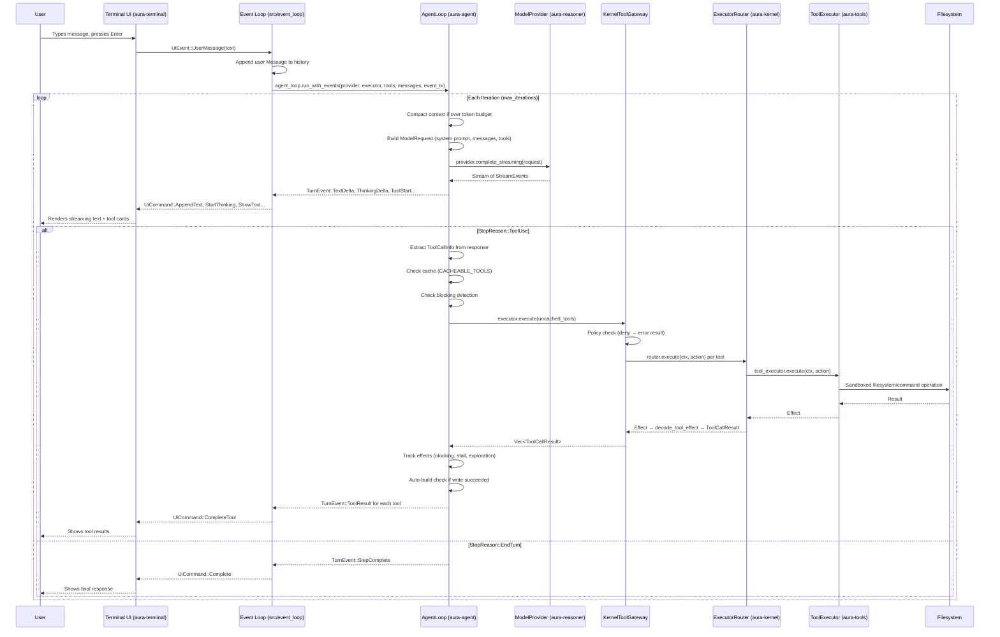
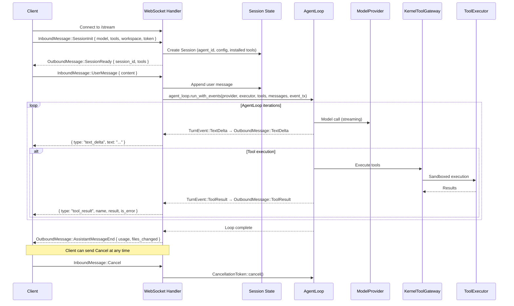
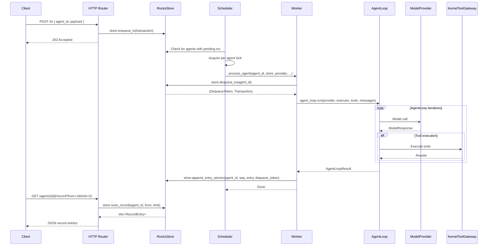
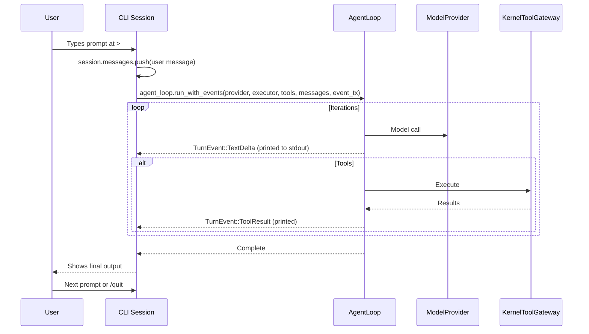
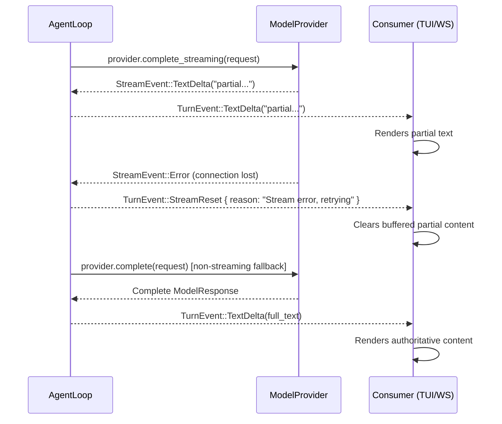

# Aura Harness — Architecture

This document describes the system architecture in two sections:

1. **Architecture** — every crate from most fundamental to least, with key types and submodules.
2. **User Flows** — how data moves through the system from the user's perspective.

---

## Part 1: Architecture

### Overview

Aura is a deterministic multi-agent runtime. Many agents run concurrently,
each maintaining its own append-only record log. A pluggable LLM provider
supplies reasoning; all side effects — filesystem writes, shell commands,
domain API calls — flow through authorized executors that capture structured
results. The full history of every agent is replayable from its record alone.

The central design decision is a strict separation between **orchestration**
and **determinism**:

**The AgentLoop** is the orchestration layer. It owns the multi-step
model-call-then-tool-execution cycle: building prompts, streaming responses,
managing token budgets, compacting context when the window fills, detecting
stalls, and emitting real-time `TurnEvent`s to whatever UI is attached
(terminal, WebSocket, CLI). The AgentLoop is intentionally stateless with
respect to persistence — it never touches the store, the policy engine, or
the record log directly. It receives a `ModelProvider` and a
`ToolExecutor` as trait objects and is unaware that these are kernel
gateways.

**The Kernel** is the deterministic core. It mediates every external
interaction: every LLM call passes through `Kernel::reason()`, every tool
execution passes through `Kernel::process()`, and every state change
produces a `RecordEntry` committed atomically to the store. The kernel
enforces policy (permission levels, session-scoped approvals), computes
context hashes for integrity verification, and maintains monotonic
sequencing. Given the same record, the kernel always produces the same
output.

This separation yields two properties:

1. **Auditability.** Because the kernel records every reasoning call, every
   tool proposal, every policy decision, and every effect, the full
   execution history is inspectable and replayable without a live LLM.

2. **Composability.** Because the AgentLoop depends only on trait
   interfaces, the same loop drives interactive TUI sessions, headless
   server workers, CLI REPLs, and long-running automaton workflows — all
   backed by the same kernel, storage, and reasoning stack.

The bridge between the two layers is a set of **gateway** types
(`KernelModelGateway`, `KernelToolGateway`) that implement the traits the
AgentLoop expects while routing calls through the kernel's recording and
policy pipeline. The AgentLoop never knows the difference.

### Crate Summary

| Crate | Role |
|------|------|
| `aura-core` | Foundational domain types, IDs, hashing, time, and shared errors used across all crates. |
| `aura-store` | Durable RocksDB-backed storage for agent records, metadata, and inbox queues. |
| `aura-reasoner` | Model-provider abstraction for completion and streaming APIs. |
| `aura-kernel` | Deterministic execution kernel with router, policies, sandboxing, and scheduler primitives. |
| `aura-tools` | Tool catalog, built-in/external tool execution, sandboxed filesystem and command tools. |
| `aura-agent` | Main agent orchestration loop: model calls, tool execution, streaming, budgets, and compaction. |
| `aura-protocol` | Wire-level request/response/event types for transport boundaries. |
| `aura-auth` | Auth token extraction/validation utilities for node and agent startup. |
| `aura-terminal` | Terminal UI layer: Ratatui-based TUI with themes, components, input, and rendering. |
| `aura-cli` | Interactive command-line REPL over the shared agent runtime. |
| `aura-automaton` | Workflow/automation helpers that drive scripted agent behavior. |
| `aura-node` | HTTP/WebSocket server runtime, session management, and scheduler-backed processing. |
| `aura` | Root binary wiring for launch modes, runtime setup, and top-level command entrypoints. |

### Dependency Graph

Crates are arranged in layers — each layer may only depend on layers below it.
Arrows (`───▶`) show the primary dependency spine; side-annotations list
additional cross-cutting dependencies.

```
 Standalone (no aura-* dependencies)
 ┌────────────────┐  ┌────────────┐  ┌──────────────┐
 │ aura-protocol  │  │  aura-auth │  │aura-terminal │
 └────────────────┘  └────────────┘  └──────────────┘

 L0  Foundation
 ┌──────────────────────────────────────────────────┐
 │                   aura-core                      │
 │  IDs, types, hashing, time, errors               │
 └────────────────────────┬─────────────────────────┘
                          │
 L1  Storage & Reasoning  │
 ┌────────────────────────┴─────────────────────────┐
 │          ┌──────────┐       ┌──────────────┐     │
 │          │aura-store│       │aura-reasoner │     │
 │          │  → core  │       │    → core    │     │
 │          └────┬─────┘       └──────┬───────┘     │
 └───────────────┼────────────────────┼─────────────┘
                 │                    │
 L2  Kernel      ▼                    ▼
 ┌──────────────────────────────────────────────────┐
 │                  aura-kernel                     │
 │  → core, store, reasoner                         │
 └────────────────────────┬─────────────────────────┘
                          │
 L3  Tools                ▼
 ┌──────────────────────────────────────────────────┐
 │                  aura-tools                      │
 │  → core, kernel, reasoner                        │
 └────────────────────────┬─────────────────────────┘
                          │
 L4  Agent                ▼
 ┌──────────────────────────────────────────────────┐
 │                  aura-agent                      │
 │  → core, kernel, reasoner, tools, store, auth    │
 └────────────────────────┬─────────────────────────┘
                          │
 L5  Higher Consumers     ▼
 ┌──────────────────────────────────────────────────┐
 │  ┌──────────────┐            ┌────────────┐      │
 │  │aura-automaton│            │  aura-cli  │      │
 │  │ → agent,core │            │ → agent,   │      │
 │  │   tools,     │            │   core,auth│      │
 │  │   reasoner   │            │   store,   │      │
 │  └──────┬───────┘            │   reasoner,│      │
 │         │                    │   tools,   │      │
 │         │                    │   kernel   │      │
 │         │                    └────────────┘      │
 └─────────┼────────────────────────────────────────┘
           │
 L6  Server▼
 ┌──────────────────────────────────────────────────┐
 │                   aura-node                      │
 │  → core, protocol, store, reasoner, kernel,      │
 │    tools, agent, automaton                        │
 └────────────────────────┬─────────────────────────┘
                          │
 L7  Binary               ▼
 ┌──────────────────────────────────────────────────┐
 │                 aura (binary)                    │
 │  → terminal, core, kernel, store, reasoner,      │
 │    tools, agent, auth, node                      │
 └──────────────────────────────────────────────────┘
```

Crates are described below in dependency order — most fundamental first.

---

### 1. `aura-core` — Domain Types & IDs

The foundation crate. Zero internal dependencies. Defines all shared domain types, strongly-typed identifiers, hashing, time utilities, and error types used across the system.

#### Key Types

| Type | Purpose |
|------|---------|
| `AgentId` | 32-byte agent identifier (BLAKE3 or UUID-derived) |
| `TxId` | 32-byte transaction identifier (content-addressed, deprecated) |
| `ActionId` | 16-byte action identifier (random) |
| `ProcessId` | 16-byte background process identifier |
| `Hash` | 32-byte BLAKE3 digest with chaining support |
| `Transaction` | Inbound work unit: `agent_id`, `TransactionType`, `payload` |
| `TransactionType` | `UserPrompt`, `AgentMsg`, `SessionStart`, `System`, `Reasoning`, ... |
| `Action` | Authorized operation: `action_id`, `ActionKind`, serialized payload |
| `ActionKind` | `Propose`, `Delegate`, `Record`, `System`, ... |
| `Effect` | Result of executing an action: `EffectKind`, `EffectStatus`, payload |
| `RecordEntry` | Immutable log entry: `seq`, `tx`, `context_hash`, proposals, actions, effects |
| `ToolCall` | Tool invocation: `tool` name + `args` (JSON) |
| `ToolResult` | Tool output: `content`, `is_error`, `metadata` |
| `ToolProposal` | Tool call with decision context |
| `ToolExecution` | Tool call + result pair |
| `ToolCallContext` | Contextual metadata for tool calls |
| `ToolDefinition` | Tool name + description + JSON Schema for input |
| `CacheControl` | Cache control hints for tool definitions |
| `InstalledToolDefinition` | External tool with endpoint, auth, schema |
| `Identity` | Agent identity struct |
| `AgentStatus` | Agent lifecycle status enum |
| `ProcessPending` | Pending background process descriptor |
| `AuraError` | Unified error enum (storage, serialization, kernel, executor, reasoner, validation) |

#### Submodules

| Module | Contents |
|--------|----------|
| `ids` | `AgentId`, `TxId`, `ActionId`, `ProcessId`, `Hash` — macro-generated newtypes with hex serde |
| `types` | All domain structs/enums — barrel re-export from `action`, `effect`, `identity`, `process`, `proposal`, `reasoner_types`, `record`, `status`, `tool`, `transaction` |
| `hash` | BLAKE3 helpers: `hash_bytes`, `hash_many`, `compute_context_hash`, `Hasher` |
| `time` | `now_ms` timestamp helper |
| `error` | `AuraError` with `thiserror` and `From` impls |
| `serde_helpers` | (crate-private) Custom serde modules for hex-encoded bytes, hashes, etc. |

---

### 2. `aura-store` — Persistent Storage

RocksDB-backed durable storage with column families for the record log, agent metadata, and transaction inbox. All mutations use `WriteBatch` for atomicity.

#### Key Types

| Type | Purpose |
|------|---------|
| `Store` (trait) | Abstract storage API: `enqueue_tx`, `dequeue_tx`, `append_entry_atomic`, `append_entry_direct`, `append_entries_batch`, `scan_record`, `get_record_entry`, `get_agent_status`, `set_agent_status`, `has_pending_tx`, `get_inbox_depth`, ... |
| `RocksStore` | `Store` implementation over RocksDB with configurable `sync_writes` |
| `DequeueToken` | Opaque token from `dequeue_tx` carrying the inbox sequence |
| `StoreError` | Error enum: `RocksDb`, `SequenceMismatch`, `ColumnFamilyNotFound`, `InboxCorruption`, `InvalidKey`, ... |

#### Column Families

| CF | Key Format | Purpose |
|----|-----------|---------|
| `record` | `R` + `AgentId` + `seq` (big-endian) | Append-only record log |
| `agent_meta` | `M` + `AgentId` + `MetaField` | Head sequence, inbox pointers, agent status |
| `inbox` | `Q` + `AgentId` + `inbox_seq` | Pending transaction queue |

#### Submodules

| Module | Contents |
|--------|----------|
| `store` | `Store` trait definition, `DequeueToken` |
| `rocks_store` | `RocksStore` implementation, `WriteBatch` atomics |
| `keys` | `RecordKey`, `AgentMetaKey`, `InboxKey` with `KeyCodec` encoding, `MetaField` enum |
| `error` | `StoreError` enum |
| `cf` | Column family name constants (`RECORD`, `AGENT_META`, `INBOX`) |

---

### 3. `aura-reasoner` — Model Provider Abstraction

Provider-agnostic interface for LLM completions. Defines normalized message types, streaming, and the `ModelProvider` trait. Ships with Anthropic and mock providers.

#### Key Types

| Type | Purpose |
|------|---------|
| `ModelProvider` (trait) | `complete(ModelRequest) -> ModelResponse`, `complete_streaming` → `StreamEventStream`, `health_check` |
| `ModelRequest` | `model`, `system`, `messages`, `tools`, `tool_choice`, `max_tokens`, `thinking`, auth headers |
| `ModelRequestBuilder` | Builder pattern for constructing `ModelRequest` |
| `ModelResponse` | `stop_reason`, `message`, `usage`, `trace`, `model_used` |
| `Message` | `role` (`User`/`Assistant`) + `content: Vec<ContentBlock>` |
| `ContentBlock` | `Text`, `Thinking`, `Image`, `ToolUse { id, name, input }`, `ToolResult { tool_use_id, content, is_error }` |
| `StopReason` | `EndTurn`, `ToolUse`, `MaxTokens`, `StopSequence` |
| `ToolChoice` | Tool selection mode |
| `ToolDefinition` | Tool name + description + JSON Schema (re-exported from `aura-core`) |
| `StreamEvent` | SSE-style events: `TextDelta`, `ThinkingDelta`, `InputJsonDelta`, `ContentBlockStart/Stop`, ... |
| `StreamAccumulator` | Folds `StreamEvent`s into a complete `ModelResponse` |
| `AnthropicProvider` | HTTP client with retry, model chain fallback, proxy/direct routing |
| `AnthropicConfig` | Provider configuration: model, routing mode, timeouts |
| `RoutingMode` | `Proxy` or `Direct` |
| `MockProvider` | Queued/canned responses for testing |

#### Submodules

| Module | Contents |
|--------|----------|
| `types/` | `Message`, `ContentBlock`, `Role`, `ImageSource`, `ModelRequest`, `ModelRequestBuilder`, `ThinkingConfig`, `ModelResponse`, `Usage`, `ProviderTrace`, `StopReason`, `StreamEvent`, `StreamContentType`, `StreamAccumulator`, `AccumulatedToolUse`, `ToolChoice` |
| `anthropic/` | `AnthropicProvider`, `AnthropicConfig`, `RoutingMode`, SSE parser, API type conversion |
| `mock` | `MockProvider`, `MockResponse` |
| `request` | `ProposeRequest`, `RecordSummary`, `ProposeLimits` (kernel propose flow) |
| `error` | `ReasonerError` |

---

### 4. `aura-kernel` — Deterministic Kernel

The invariant core. Builds context from the record, calls the reasoner, enforces policy, dispatches execution through the router, and produces `RecordEntry`s. Given the same record, produces the same output. Uses dynamic dispatch (`Arc<dyn Store>`, `Arc<dyn ModelProvider>`) rather than generic type parameters.

#### Key Types

| Type | Purpose |
|------|---------|
| `Kernel` | End-to-end step processor bound to a specific agent, with `process_direct`, `process_dequeued`, `reason`, `reason_streaming`, `process_tools` |
| `KernelConfig` | `record_window_size`, `policy`, `workspace_base`, `replay_mode`, `proposal_timeout_ms` |
| `ProcessResult` | `entry`, `tool_output`, `had_failures` |
| `ReasonResult` | `entry`, `response` — result of a reasoning call |
| `ReasonStreamHandle` | Handle for recording streaming results (completed or failed) |
| `ToolOutput` | Single tool execution output: `tool_use_id`, `content`, `is_error` |
| `ExecutorRouter` | Routes `Action`s to the first matching `Executor` in a registry |
| `Executor` (trait) | `execute(ctx, action) -> Effect`, `can_handle(action) -> bool` |
| `ExecuteContext` | Per-action context: `agent_id`, `action_id`, `workspace_root`, `limits` |
| `ExecuteLimits` | Caps for read/write bytes, command timeout, stdout/stderr |
| `Policy` | Runtime permission engine with session approval memory |
| `PolicyConfig` | Allowed action kinds, tool allowlists, per-tool `PermissionLevel` overrides |
| `PermissionLevel` | `AlwaysAllow`, `AskOnce`, `RequireApproval`, `Deny` |
| `PolicyResult` | Result of a policy check |
| `ContextBuilder` | Builds `Context` (context hash + record summaries) from transaction + record window |
| `decode_tool_effect` | Parses an `Effect` back into human-readable `DecodedToolResult` |
| `KernelError` | Error enum: `Store`, `Reasoner`, `Timeout`, `Serialization`, `Internal` |

#### Submodules

| Module | Contents |
|--------|----------|
| `executor` | `Executor` trait, `ExecutorError`, `ExecuteContext`, `ExecuteLimits`, `DecodedToolResult`, `decode_tool_effect` |
| `router` | `ExecutorRouter` — fan-out dispatch to registered executors |
| `policy` | `Policy`, `PolicyConfig`, `PolicyResult`, `PermissionLevel`, `default_tool_permission` |
| `context` | `Context`, `ContextBuilder` |
| `kernel` | `Kernel`, `KernelConfig`, `ProcessResult`, `ReasonResult`, `ReasonStreamHandle`, `ToolOutput` |

---

### 5. `aura-tools` — Tool Registry & Execution

Filesystem, command, search, and domain tools. Sandboxed execution ensures agents cannot escape their workspace. Implements the `Executor` trait from `aura-kernel`.

#### Key Types

| Type | Purpose |
|------|---------|
| `ToolRegistry` (trait) | `list() -> Vec<ToolDefinition>`, `get(name) -> Option<ToolDefinition>`, `has(name) -> bool` |
| `DefaultToolRegistry` | HashMap-backed registry pre-loaded with builtin tools |
| `ToolExecutor` | Dispatches `ToolCall`s to registered `Tool` impls; implements `Executor` |
| `ToolResolver` | Catalog-backed visibility + optional domain executor fallback; implements `Executor` |
| `ToolCatalog` | Merged catalog of all tools with profile-based visibility (`Core`, `Agent`, `Engine`) |
| `Sandbox` | Path validation: canonicalize, prefix-check, symlink guard |
| `Tool` (trait) | `name()`, `definition()`, `execute(ToolCall, Sandbox) -> ToolResult` — individual tool implementation |
| `ToolConfig` | Feature flags and size limits |
| `ToolError` | Tool execution error enum with `error_code()` and `is_recoverable()` |

#### Built-in Tools (`fs_tools/`)

| Tool | Module | Description |
|------|--------|-------------|
| `list_files` | `ls.rs` | Directory listing |
| `read_file` | `read.rs` | File read with size limits |
| `write_file` | `write.rs` | File write (creates directories) |
| `edit_file` | `edit.rs` | Targeted string replacement in files |
| `stat_file` | `stat.rs` | File metadata |
| `find_files` | `find.rs` | File search by name pattern |
| `delete_file` | `delete.rs` | File deletion |
| `search_code` | `search/` | Ripgrep-powered code search |
| `run_command` | `cmd/` | Shell command execution with sync/async threshold |

#### Domain Tools (`domain_tools/`)

HTTP/API-backed tools dispatched through `DomainToolExecutor`. Provides handlers for specs, tasks, projects, storage, orbit, and network operations via the `DomainApi` trait.

#### Automaton Tools (`automaton_tools`)

Dev-loop and task control tools (`start_dev_loop`, `pause_dev_loop`, `stop_dev_loop`, `run_task`) gated behind an `AutomatonController` trait, registered separately from the default builtin set.

#### Submodules

| Module | Contents |
|--------|----------|
| `registry` | `ToolRegistry` trait, `DefaultToolRegistry` |
| `executor` | `ToolExecutor` — dispatches to `Tool` impls, builds `Sandbox` |
| `resolver` | `ToolResolver` — catalog + domain executor integration |
| `catalog` | `ToolCatalog`, `ToolProfile`, `ToolOwner`, `CatalogEntry` |
| `sandbox` | `Sandbox` — path confinement and validation |
| `tool` | `Tool` trait, `ToolContext`, `builtin_tools()`, `read_only_builtin_tools()` |
| `definitions` | Static `ToolDefinition` sets for catalog profiles |
| `fs_tools/` | All built-in tool implementations |
| `domain_tools/` | `DomainToolExecutor`, `DomainApi` trait, per-area handlers (orbit, network, specs, tasks, project, storage) |
| `automaton_tools` | `AutomatonController` trait and dev-loop/task tools |

---

### 6. `aura-agent` — Orchestration Layer

The heart of the runtime. `AgentLoop` is the **sole orchestrator** — it drives the multi-step agentic conversation loop, calling the model, executing tools, and managing streaming, blocking detection, stall detection, budget, and compaction.

#### Core Orchestration

```
 AgentLoop ──▶ ModelProvider
     │
     ├──▶ KernelToolGateway ──▶ ExecutorRouter ──▶ ToolExecutor ──▶ Sandbox
     │
     └──events──▶ Event Channel
```

| Type | Purpose |
|------|---------|
| `AgentLoop` | Multi-step loop: model call → tool execution → repeat until `EndTurn` or budget exhaustion |
| `AgentLoopConfig` | Tunables: `max_iterations`, `max_tokens`, `stream_timeout`, `credit_budget`, `exploration_allowance`, `system_prompt`, `model`, auth headers, `tool_hints`, thinking taper |
| `KernelToolGateway` | Bridges agent tool execution → `ExecutorRouter`: parallel/sequential mode, per-tool timeouts, policy deny |
| `KernelModelGateway` | Bridges agent model calls → kernel reasoning |
| `AgentToolExecutor` (trait) | `execute(&[ToolCallInfo]) -> Vec<ToolCallResult>` + optional `auto_build_check` |
| `TurnEvent` | Unified streaming events: `TextDelta`, `ThinkingDelta`, `ToolStart`, `ToolResult`, `IterationComplete`, `StreamReset`, `Error`, ... |
| `AgentLoopEvent` | Type alias for `TurnEvent` |
| `AgentLoopResult` | Final outcome: token totals, iteration count, `stalled`/`timed_out`/`insufficient_credits` flags, messages |
| `AgentError` | Error enum: model, tool, timeout, build, internal variants |

#### AgentLoop Iteration

```
 ┌─────────────────────┐
 │   Begin Iteration   │◄──────────────────────────────┐
 └──────────┬──────────┘                               │
            ▼                                          │
 ┌─────────────────────┐                               │
 │ Compact context     │                               │
 │ (if needed)         │                               │
 └──────────┬──────────┘                               │
            ▼                                          │
 ┌─────────────────────┐                               │
 │ Build model request │                               │
 └──────────┬──────────┘                               │
            ▼                                          │
 ┌─────────────────────┐                               │
 │ Call model provider │                               │
 └──────────┬──────────┘                               │
            ▼                                          │
       ┌─────────┐  yes  ┌───────────────────┐         │
       │Streaming│──────▶│ Accumulate stream  │         │
       │    ?    │       │ events             │         │
       └────┬────┘       └─────────┬─────────┘         │
         no │                      │                    │
            ▼                      │                    │
    ┌───────────────┐              │                    │
    │ Run complete  │              │                    │
    │ call          │              │                    │
    └───────┬───────┘              │                    │
            │◄─────────────────────┘                    │
            ▼                                          │
 ┌─────────────────────┐                               │
 │ Emit iteration      │                               │
 │ complete event      │                               │
 └──────────┬──────────┘                               │
            ▼                                          │
       ┌──────────┐                                    │
       │  Stop    │                                    │
       │  reason? │                                    │
       └─┬──┬──┬──┘                                    │
         │  │  │                                       │
 EndTurn │  │  │ ToolUse                               │
         │  │  │                                       │
         │  │  ▼                                       │
         │  │ ┌─────────────────────────────┐          │
         │  │ │ Split cached / uncached     │          │
         │  │ └─────────────┬───────────────┘          │
         │  │               ▼                          │
         │  │ ┌─────────────────────────────┐          │
         │  │ │ Split blocked / executable  │          │
         │  │ └─────────────┬───────────────┘          │
         │  │               ▼                          │
         │  │ ┌─────────────────────────────┐          │
         │  │ │ Execute tools               │          │
         │  │ └─────────────┬───────────────┘          │
         │  │               ▼                          │
         │  │ ┌─────────────────────────────┐          │
         │  │ │ Track blocking / stall /    │          │
         │  │ │ exploration                 │          │
         │  │ └─────────────┬───────────────┘          │
         │  │               ▼                          │
         │  │          ┌──────────┐  yes ┌───────────┐ │
         │  │          │  Write   │─────▶│ Auto-build│ │
         │  │          │succeeded?│      │ check     │ │
         │  │          └────┬─────┘      └─────┬─────┘ │
         │  │            no │                  │       │
         │  │               ▼                  ▼       │
         │  │           ┌──────────────────────────┐   │
         │  │           │     Next iteration       │───┘
         │  │           └──────────────────────────┘
         │  │ MaxTokens
         ▼  ▼
 ┌─────────────────┐
 │  Return result  │
 └─────────────────┘
```

#### Submodules

| Module | Contents |
|--------|----------|
| `agent_loop/` | Core loop: `mod.rs` (AgentLoop, config, state), `iteration.rs` (model calls), `streaming.rs` (event emission), `tool_execution.rs` (cache/execute/emit), `tool_processing.rs` (blocking/stall/build), `context.rs` (compaction) |
| `kernel_gateway.rs` | `KernelToolGateway`, `KernelModelGateway` — kernel bridge implementations |
| `kernel_executor.rs` | `KernelToolExecutor` (deprecated alias) |
| `events.rs` | `TurnEvent` enum (alias: `AgentLoopEvent`) |
| `types.rs` | `AgentToolExecutor` trait, `ToolCallInfo`, `ToolCallResult`, `AgentLoopResult`, `BuildBaseline`, `AutoBuildResult` |
| `blocking/` | `detection/` (write-failure tracking, read-guard), `stall.rs` (repeated-target detection) |
| `budget.rs` | `BudgetState`, `ExplorationState` — token and exploration tracking |
| `constants.rs` | Shared constants: model names, iteration limits, thresholds, tool categories |
| `compaction/` | Context window compression when approaching token limits |
| `build.rs` | Build output parsing and baseline annotation |
| `prompts/` | `system/` (system prompt generation), `fix/` (error recovery prompts), `context.rs`, `turn_kernel_system.rs` |
| `verify/` | Build verification runner, error signatures, test baseline capture |
| `runtime/process_manager/` | `ProcessManager` — background process tracking with completion callbacks |
| `agent_runner/` | Higher-level agent run coordination (`AgentRunner`, `AgentRunnerConfig`, task execution) |
| `session_bootstrap.rs` | `resolve_store_path`, `open_store`, `build_tool_executor`, `select_provider`, `load_auth_token` |
| `sanitize.rs` | Message sanitization (malformed tool_use/tool_result repair) |
| `read_guard.rs` | Tracks which files have been read (full vs range) to prevent redundant reads |
| `helpers.rs` | `is_write_tool`, `is_exploration_tool`, `append_warning` |
| `policy.rs` | Agent-level policy checks, task complexity/budgets |
| `planning.rs` | Plan detection and handling |
| `shell_parse.rs` | Shell command output parsing |
| `self_review.rs` | Self-review guard |
| `task_context.rs` | Task-scoped context for multi-task agents |
| `task_executor/` | Task execution handlers |
| `file_ops/` | File operation pipeline: apply, validation, stub detection, workspace mapping, file walkers |
| `git.rs` | Git integration helpers (`is_git_repo`, `git_commit`, `git_push`, `list_unpushed_commits`) |
| `message_conversion.rs` | Protocol ↔ internal message conversion |
| `parser.rs` | Message/output parsing utilities |

---

### 7. `aura-protocol` — Wire Protocol Types

Serde types for the `/stream` WebSocket API. Consumed by both the harness server (`aura-node`) and external clients. Self-contained — no dependency on any `aura-*` crate (wire-compatible by convention).

| Type | Direction | Purpose |
|------|-----------|---------|
| `InboundMessage` | Client → Server | `SessionInit`, `UserMessage`, `Cancel`, `ApprovalResponse` |
| `OutboundMessage` | Server → Client | `SessionReady`, `AssistantMessageStart`, `TextDelta`, `ThinkingDelta`, `ToolUseStart`, `ToolResult`, `AssistantMessageEnd`, `Error` |
| `SessionInit` | Inbound | System prompt, model, max tokens, installed tools, workspace, auth, conversation history |
| `UserMessage` | Inbound | User message content |
| `ApprovalResponse` | Inbound | Approval decision for tool execution |
| `SessionReady` | Outbound | Session confirmation with tool list |
| `SessionUsage` | Outbound | Per-turn token counts, context utilization, model/provider name |
| `InstalledTool` | Inbound | External tool definition with endpoint, auth, schema |
| `ConversationMessage` | Both | Conversation history message |
| `FilesChanged` | Outbound | File operation tracking (embedded in `AssistantMessageEnd`) |

---

### 8. `aura-auth` — Authentication

JWT credential management for proxy-routed LLM access (zOS login). No dependency on any `aura-*` crate.

| Type | Purpose |
|------|---------|
| `CredentialStore` | Read/write `~/.aura/credentials.json` |
| `StoredSession` | `access_token`, `user_id`, `display_name`, `primary_zid`, `created_at` |
| `ZosClient` | HTTP client for zOS authentication endpoints |
| `AuthError` | Authentication failure types |

---

### 9. `aura-terminal` — Terminal UI

Ratatui-based TUI library. Provides the `App` state machine, themed rendering, input handling, and a component library. Communicates with the orchestration layer through `UiEvent`/`UiCommand` channels. No dependency on any `aura-*` crate.

| Type | Purpose |
|------|---------|
| `App` | UI state machine: messages, tools, streaming content, approval state, panel focus |
| `AppState` | `Idle`, `Processing`, `AwaitingApproval`, `ShowingHelp`, `LoginEmail`, `LoginPassword` |
| `Terminal` | Ratatui terminal wrapper with theme and rendering |
| `Theme` | Color scheme with `ThemeColors` and `BorderStyle` |
| `UiEvent` | User actions: `UserMessage`, `Approve`, `Cancel`, `Quit`, `NewSession`, ... |
| `UiCommand` | System → UI: `AppendText`, `ShowTool`, `CompleteTool`, `RequestApproval`, ... |

#### Components

`HeaderBar`, `InputField`, `Message`, `ToolCard`, `StatusBar`, `ProgressBar`, `DiffView`

#### Submodules

| Module | Contents |
|--------|----------|
| `app/` | `App` state machine, command handling, key bindings, formatting |
| `renderer/` | Panel rendering, segments, markdown, text, input, overlays |
| `events` | `UiEvent`, `UiCommand`, `MessageData`, `MessageRole`, `ToolData`, `RecordSummary` |
| `components/` | Reusable UI widgets: header, input, message, tool card, status, progress, diff, code block |
| `themes/` | `Theme`, `ThemeColors`, `BorderStyle`, color constants |
| `animation/` | `Spinner`, `SpinnerStyle` |
| `input/` | `InputHistory` |
| `layout/` | `LayoutMode`, responsive sizing |

---

### 10. `aura-cli` — Interactive REPL

Binary-only crate providing an interactive command-line session. Wires `AgentLoop` to a REPL with slash commands.

| Type | Purpose |
|------|---------|
| `Session` | Holds `AgentLoop`, provider, executor, store, messages, identity |
| `SessionConfig` | `data_dir`, `workspace_root`, `provider`, `agent_name`, `loop_config` |
| `Command` | Slash-command enum: `/status`, `/history`, `/login`, `/logout`, `/whoami`, `/approve`, `/deny`, `/diff`, `/help`, `/quit` |
| `ApprovalQueue` | Pending approval requests |

#### Submodules

| Module | Contents |
|--------|----------|
| `session` | `Session`, `SessionConfig` |
| `commands` | `Command` enum parsing |
| `handlers` | Command handlers (`handle_prompt`, `handle_status`, `handle_history`, `handle_login`, ...) |
| `approval` | `ApprovalRequest`, `ApprovalDecision`, `ApprovalQueue` |
| `session_helpers` | Re-exports from `aura_agent::session_bootstrap` |
| `ui` | `print_help`, `banner` |

---

### 11. `aura-automaton` — Workflow Automation

Long-running automaton workflows that drive `AgentLoop` on a schedule.

| Type | Purpose |
|------|---------|
| `Automaton` (trait) | `kind()`, `tick()`, `on_install()`, `on_stop()` |
| `AutomatonRuntime` | Installs, runs, and cancels automaton instances |
| `AutomatonHandle` | Control handle for a running automaton |
| `Schedule` | Tick scheduling configuration |
| `AutomatonState` | Runtime state for an automaton instance |
| `AutomatonId` | Unique automaton identifier |
| `AutomatonInfo` | Metadata about a running automaton |
| `AutomatonStatus` | Lifecycle status enum |
| `AutomatonError` | Error enum |
| `AutomatonEvent` | Events emitted during automaton execution |
| `TickContext` | Context provided to each automaton tick |

#### Built-in Automatons

| Automaton | Module | Description |
|-----------|--------|-------------|
| `ChatAutomaton` | `builtins/chat.rs` | Interactive chat sessions |
| `DevLoopAutomaton` | `builtins/dev_loop/` | Iterative development loop with commit-and-push support |
| `SpecGenAutomaton` | `builtins/spec_gen.rs` | Specification generation |
| `TaskRunAutomaton` | `builtins/task_run.rs` | Task execution |

#### Submodules

| Module | Contents |
|--------|----------|
| `runtime` | `Automaton` trait, `TickOutcome`, `AutomatonRuntime` |
| `handle` | `AutomatonHandle` |
| `schedule` | `Schedule` |
| `state` | `AutomatonState` |
| `types` | `AutomatonId`, `AutomatonInfo`, `AutomatonStatus`, `TaskExecution`, `TaskOutcome`, `FileOpRecord` |
| `context` | `TickContext` |
| `events` | `AutomatonEvent` |
| `error` | `AutomatonError` |
| `builtins/` | `ChatAutomaton`, `DevLoopAutomaton`, `SpecGenAutomaton`, `TaskRunAutomaton` |

---

### 12. `aura-node` — HTTP & WebSocket Server

Headless server with REST API, WebSocket streaming sessions, per-agent scheduling, and a worker loop.

| Type | Purpose |
|------|---------|
| `Node` | Top-level server: binds listener, opens store, starts scheduler + router |
| `NodeConfig` | `port`, `host`, `data_dir`, `sync_writes`, `workspace_base`, ... |
| `NodeError` | Server error types |
| `Scheduler` | Per-agent mutex scheduling; drains inbox via worker |
| `RouterState` | Axum shared state: store, scheduler, config, provider, catalog, automaton controller |
| `Session` | WebSocket session state: agent ID, model config, installed tools, messages, workspace |

#### HTTP Routes

| Endpoint | Method | Purpose |
|----------|--------|---------|
| `/health` | GET | Liveness check |
| `/tx` | POST | Submit transaction |
| `/tx/status/:agent_id/:tx_id` | GET | Transaction status |
| `/agents/:agent_id/head` | GET | Read agent head sequence |
| `/agents/:agent_id/record` | GET | Scan agent record log |
| `/api/files` | GET | List files from workspace |
| `/api/read-file` | GET | Read file content from workspace |
| `/workspace/resolve` | GET | Resolve workspace path |
| `/stream` | GET (WS) | WebSocket session for interactive use |
| `/stream/automaton/:automaton_id` | GET (WS) | WebSocket for automaton streaming |
| `/ws/terminal` | GET (WS) | Terminal WebSocket |
| `/automaton/start` | POST | Start an automaton |
| `/automaton/list` | GET | List running automatons |
| `/automaton/:automaton_id/status` | GET | Automaton status |
| `/automaton/:automaton_id/pause` | POST | Pause automaton |
| `/automaton/:automaton_id/stop` | POST | Stop automaton |

#### Submodules

| Module | Contents |
|--------|----------|
| `node.rs` | `Node` struct and `run` |
| `config/` | `NodeConfig`, env loading |
| `router/` | Axum router, `RouterState`, route handlers (`tx`, `ws`, `files`, `automaton`) |
| `scheduler.rs` | `Scheduler` — per-agent locking and dispatch |
| `worker.rs` | `process_agent` — dequeue + `AgentLoop` execution |
| `session/` | `Session` state, `handle_ws_connection`, `TurnEvent` → `OutboundMessage` mapping |
| `terminal.rs` | Terminal WebSocket handler |
| `automaton_bridge.rs` | Bridge between automaton runtime and node sessions |
| `domain.rs` | `HttpDomainApi` — HTTP-backed `DomainApi` implementation |
| `jwt_domain.rs` | `JwtDomainApi` — JWT-authenticated domain API |
| `executor_factory.rs` | `build_tool_resolver`, `build_executor_router` |
| `protocol.rs` | Helper conversions between protocol and internal types |

---

### 13. `aura` (Root Binary)

The primary entry point. Supports TUI mode (default) and headless mode.

| Module | Purpose |
|--------|---------|
| `main.rs` | CLI parse, auth subcommands (`login`/`logout`/`whoami`), `run_with_args` |
| `cli.rs` | Clap definitions: `Cli`, `Commands`, `RunArgs`, `UiMode` (Terminal/None) |
| `event_loop/` | Terminal event loop: `EventLoopContext`, `run_event_loop` — bridges `UiEvent` ↔ `AgentLoop` ↔ `UiCommand`. Subfiles: `handlers.rs`, `agent_events.rs`, `record_ui.rs` |
| `session_helpers.rs` | Re-exports from `aura_agent::session_bootstrap`, plus `default_agent_config` |
| `api_server.rs` | Embedded `/health` endpoint for TUI mode |
| `record_loader.rs` | Record loading utilities |

---

## Part 2: User Flows

### Flow 1: Interactive TUI Session

The default mode when a user runs `cargo run` or `aura`.



**Data path:** User input → `UiEvent` channel → Event Loop appends to `Vec<Message>` → `AgentLoop.run_with_events()` → streaming `TurnEvent`s back through `mpsc` channel → Event Loop maps to `UiCommand` → Terminal renders.

---

### Flow 2: WebSocket Session (aura-node)

Used by `aura-os` and other clients connecting over the `/stream` WebSocket endpoint.



**Data path:** JSON over WebSocket → `InboundMessage` deserialized → Session state updated → `AgentLoop` runs with event channel → `TurnEvent`s mapped to `OutboundMessage` → JSON back over WebSocket.

---

### Flow 3: Headless Node (Scheduler-Driven)

When running `aura run --ui none` or as `aura-node`, transactions are submitted via HTTP and processed by the scheduler.



**Data path:** HTTP POST → Store inbox → Scheduler dequeues → Worker runs `AgentLoop` (no streaming) → Result committed atomically to record log → Client polls via GET.

---

### Flow 4: CLI REPL (aura-cli)

The `aura-cli` binary provides a minimal interactive session without the TUI.



---

### Flow 5: Streaming Error Recovery (StreamReset)

When a streaming model call fails mid-stream, the system recovers deterministically.



---

### Data Lifecycle Summary

```
 INPUT                 PROCESSING                                      OUTPUT
 ─────                 ──────────                                      ──────

 User Prompt           ┌─────────────────────────────────────────┐
     │                 │                                         │
     ▼                 │  AgentLoop                              │
 Transaction ─────────▶│     │                                   │
                       │     ▼                                   │
                       │  ModelProvider ──▶ ModelResponse         │
                       │                       │                 │
                       │                  StopReason?            │
                       │                 ╱          ╲            │
                       │           ToolUse          EndTurn      │     Record Entry
                       │              │                │         │──▶  ──▶ RocksDB
                       │              ▼                ▼         │
                       │  KernelToolGateway      AgentLoopResult │──▶  TurnEvents
                       │       │                                 │     ──▶ UI / WS
                       │       ▼                                 │
                       │  ExecutorRouter                         │
                       │       │                                 │
                       │       ▼                                 │
                       │  ToolExecutor + Sandbox                 │
                       │       │                                 │
                       │       ▼                                 │
                       │    Effect ───────▶ (back to AgentLoop)  │
                       │                                         │
                       └─────────────────────────────────────────┘
```

Every user interaction follows the same fundamental path: input becomes a transaction, the `AgentLoop` orchestrates model calls and tool execution in a loop, results are emitted as `TurnEvent`s for real-time display, and the final state is persisted as a `RecordEntry` in the append-only log.
