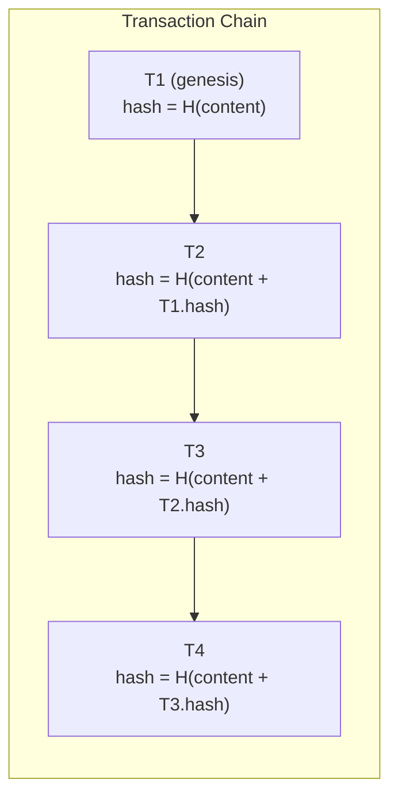
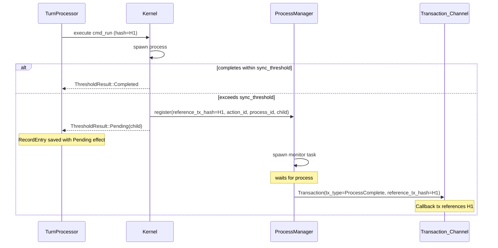

# Process Manager — Spec 07

**Status**: Implementation-ready  
**Builds on**: spec-01-aura.md, spec-02-interactive-runtime.md  
**Goal**: Threshold-based async command execution with blockchain-style hash chaining for immutable, append-only agent records

---

## 1) Goals

Implement async process management that preserves AURA's core architectural principles:

* **Threshold-based execution**: Commands completing within a configurable threshold return synchronously; longer-running processes transition to async tracking
* **Blockchain-style hash chaining**: Transaction hashes are derived from content + previous transaction hash, creating a cryptographic chain
* **Reference linkage**: Callback transactions reference their originating transaction via `reference_tx_hash`, enabling logical relationship traversal
* **Immutability**: The append-only nature of the Agent record is preserved; no modification of past entries

---

## 2) Core Architectural Principle

Agent records are **pure, atomic, immutable, and append-only**. The Transaction model enforces this via:

1. **Hash Chain** — The `hash` is derived from content + previous transaction's hash, creating a cryptographic chain like a blockchain. Modifying any past transaction breaks the chain.

2. **Reference Linkage** (`reference_tx_hash`) — Callback transactions (async tool results) reference their originating transaction, creating a DAG for logical relationships.

---

## 3) Transaction Model

### 3.1 Transaction Structure

```rust
pub struct Transaction {
    /// Unique hash derived from content + previous tx hash (blockchain-style chain)
    #[serde(with = "hex_hash")]
    pub hash: Hash,
    /// Target agent
    pub agent_id: AgentId,
    /// Timestamp in milliseconds since epoch
    pub ts_ms: u64,
    /// Type of transaction
    pub tx_type: TransactionType,
    /// Versioned payload (opaque bytes)
    #[serde(with = "bytes_serde")]
    pub payload: Bytes,
    /// Optional reference to a related transaction (for callbacks from async processes)
    #[serde(default, skip_serializing_if = "Option::is_none", with = "option_hex_hash")]
    pub reference_tx_hash: Option<Hash>,
}

pub enum TransactionType {
    UserPrompt,       // User-initiated prompt/message
    AgentMsg,         // Message from another agent
    Trigger,          // Scheduled or event-based trigger
    ActionResult,     // Result from a previously executed action
    System,           // System-generated transaction
    SessionStart,     // Session/context reset marker
    ToolProposal,     // Tool suggestion from LLM (before policy)
    ToolExecution,    // Tool result (after policy decision)
    ProcessComplete,  // Async process completion (callback from background process)
}
```

### 3.2 Key Design Decisions

| Field | Purpose |
|-------|---------|
| `hash` | Derived from `hash(content + prev_tx_hash)`. Chain is implicit in derivation. Genesis tx uses `hash(content)` with no prior. |
| `tx_type` | Categorizes the transaction (renamed from `kind`/`TransactionKind`) |
| `reference_tx_hash` | Optional logical link to a related transaction. Only used by tools/processes for callbacks. |

---

## 4) Hash Chain Model

### 4.1 Chain Structure



The chain is **implicit** in the hash derivation. Modifying T2 would:

1. Change T2.hash
2. Which changes T3's input (content + T2.hash)
3. Which changes T3.hash
4. Breaking all downstream references

### 4.2 Hash Implementation

```rust
/// A 32-byte blake3 hash (full output, not truncated).
#[derive(Clone, Copy, Default, PartialEq, Eq, Hash, Serialize, Deserialize)]
pub struct Hash(#[serde(with = "hex_bytes_32")] pub [u8; 32]);

impl Hash {
    /// Create a new `Hash` from raw bytes.
    pub const fn new(bytes: [u8; 32]) -> Self {
        Self(bytes)
    }

    /// Create hash from content only (genesis transaction).
    pub fn from_content(content: &[u8]) -> Self {
        let hash = blake3::hash(content);
        Self(*hash.as_bytes())
    }

    /// Create hash from content and previous transaction's hash.
    /// Genesis transaction passes None for prev_hash.
    pub fn from_content_chained(content: &[u8], prev_hash: Option<&Hash>) -> Self {
        let mut hasher = blake3::Hasher::new();
        hasher.update(content);
        if let Some(prev) = prev_hash {
            hasher.update(&prev.0);
        }
        Self(*hasher.finalize().as_bytes())
    }

    pub const fn as_bytes(&self) -> &[u8; 32] {
        &self.0
    }

    pub fn to_hex(&self) -> String {
        hex::encode(self.0)
    }

    pub fn from_hex(s: &str) -> Result<Self, hex::FromHexError> {
        let bytes = hex::decode(s)?;
        let arr: [u8; 32] = bytes
            .try_into()
            .map_err(|_| hex::FromHexError::InvalidStringLength)?;
        Ok(Self(arr))
    }
}
```

**Note**: `Hash` is a 32-byte array wrapper (full blake3 output), replacing the 16-byte `TxId`.

---

## 5) Async Process Flow

### 5.1 Sequence Diagram



### 5.2 Two Orthogonal Concepts

| Concept | Purpose |
|---------|---------|
| `hash` | Sequential chain (implicit in derivation). Every tx depends on previous tx. |
| `reference_tx_hash` | Logical link for callbacks. Only used by tools/processes. |

---

## 6) Record Entry Examples

### 6.1 Original RecordEntry (seq=N) — Starts a Long-Running Process

```rust
RecordEntry {
    seq: N,
    tx: Transaction {
        hash: Hash("abc123..."),  // H(content + prev_tx.hash)
        tx_type: TransactionType::UserPrompt,
        reference_tx_hash: None,  // Top-level transaction (no callback reference)
        ...
    },
    effects: [
        Effect {
            action_id: ActionId(...),
            kind: EffectKind::Agreement,
            status: EffectStatus::Pending,
            payload: ProcessPending { 
                process_id: ProcessId(...),
                command: "cargo build --release",
                started_at_ms: 1704825600000,
            }
        }
    ]
}
```

### 6.2 Completion RecordEntry (seq=N+M) — Process Finished

```rust
RecordEntry {
    seq: N + M,
    tx: Transaction {
        hash: Hash("def456..."),  // H(content + prev_tx.hash) - chain continues
        tx_type: TransactionType::ProcessComplete,  // Note: ProcessComplete, not ActionResult
        reference_tx_hash: Some(Hash("abc123...")),  // Links to originating tx!
        payload: ActionResultPayload { ... }
    },
    effects: [Effect::committed_agreement(...)]
}
```

---

## 7) Data Types

### 7.1 Process Types (aura-core/src/ids.rs)

```rust
/// Process identifier - 16 bytes, generated per async process.
#[derive(Clone, Copy, Default, PartialEq, Eq, Hash, Serialize, Deserialize)]
pub struct ProcessId(#[serde(with = "hex_bytes_16")] pub [u8; 16]);

impl ProcessId {
    pub const fn new(bytes: [u8; 16]) -> Self {
        Self(bytes)
    }

    /// Generate a new random `ProcessId`.
    pub fn generate() -> Self {
        let uuid = uuid::Uuid::new_v4();
        Self(*uuid.as_bytes())
    }

    pub const fn as_bytes(&self) -> &[u8; 16] {
        &self.0
    }

    pub fn to_hex(&self) -> String {
        hex::encode(self.0)
    }
}
```

### 7.2 Payload Types (aura-core/src/types.rs)

```rust
/// Payload for a pending process effect.
///
/// This is stored in the Effect payload when a command exceeds the sync threshold
/// and is moved to async execution.
#[derive(Debug, Clone, PartialEq, Eq, Serialize, Deserialize)]
pub struct ProcessPending {
    /// Unique process identifier for tracking
    pub process_id: ProcessId,
    /// The command being executed
    pub command: String,
    /// When the process started (milliseconds since epoch)
    pub started_at_ms: u64,
}

impl ProcessPending {
    /// Create a new pending process payload.
    pub fn new(process_id: ProcessId, command: impl Into<String>) -> Self {
        let started_at_ms = std::time::SystemTime::now()
            .duration_since(std::time::UNIX_EPOCH)
            .map(|d| u64::try_from(d.as_millis()).unwrap_or(u64::MAX))
            .unwrap_or(0);

        Self {
            process_id,
            command: command.into(),
            started_at_ms,
        }
    }
}

/// Payload for ActionResult transactions from completed async processes.
///
/// This is used when an async process completes and needs to be recorded
/// as a continuation of the original transaction.
#[derive(Debug, Clone, PartialEq, Eq, Serialize, Deserialize)]
pub struct ActionResultPayload {
    /// The action_id this result continues
    pub action_id: ActionId,
    /// Process identifier for correlation
    pub process_id: ProcessId,
    /// Exit code from the process
    #[serde(default, skip_serializing_if = "Option::is_none")]
    pub exit_code: Option<i32>,
    /// Standard output from the process
    #[serde(default, with = "bytes_serde")]
    pub stdout: Bytes,
    /// Standard error from the process
    #[serde(default, with = "bytes_serde")]
    pub stderr: Bytes,
    /// Whether the process succeeded
    pub success: bool,
    /// Duration in milliseconds
    pub duration_ms: u64,
}

impl ActionResultPayload {
    /// Create a successful result payload.
    pub fn success(
        action_id: ActionId,
        process_id: ProcessId,
        exit_code: Option<i32>,
        stdout: impl Into<Bytes>,
        duration_ms: u64,
    ) -> Self { ... }

    /// Create a failed result payload.
    pub fn failure(
        action_id: ActionId,
        process_id: ProcessId,
        exit_code: Option<i32>,
        stderr: impl Into<Bytes>,
        duration_ms: u64,
    ) -> Self { ... }
}
```

### 7.3 Transaction Constructors (aura-core/src/types.rs)

```rust
impl Transaction {
    /// Create a new transaction chained to a previous transaction.
    pub fn new_chained(
        agent_id: AgentId,
        tx_type: TransactionType,
        payload: impl Into<Bytes>,
        prev_hash: Option<&Hash>,
    ) -> Self { ... }

    /// Create an action result with a reference to the originating transaction.
    pub fn action_result_with_reference(
        agent_id: AgentId,
        payload: impl Into<Bytes>,
        reference_tx_hash: Hash,
        prev_hash: Option<&Hash>,
    ) -> Self { ... }

    /// Create a process completion transaction.
    ///
    /// Records the result of an async process that completed after the initial
    /// transaction was recorded. Links back to the originating transaction.
    pub fn process_complete(
        agent_id: AgentId,
        payload: &ActionResultPayload,
        reference_tx_hash: Hash,
        prev_hash: Option<&Hash>,
    ) -> Self { ... }
}
```

---

## 8) ProcessManager Component

### 8.1 Location

`aura-kernel/src/process_manager.rs`

### 8.2 Configuration

```rust
/// Configuration for the process manager.
#[derive(Debug, Clone)]
pub struct ProcessManagerConfig {
    /// Maximum timeout for async processes (milliseconds).
    pub max_async_timeout_ms: u64,
    /// Polling interval for process completion (milliseconds).
    pub poll_interval_ms: u64,
}

impl Default for ProcessManagerConfig {
    fn default() -> Self {
        Self {
            max_async_timeout_ms: 600_000, // 10 minutes
            poll_interval_ms: 100,         // 100ms polling
        }
    }
}
```

### 8.3 Structure

```rust
/// Information about a running process.
pub struct RunningProcess {
    /// The action ID this process belongs to.
    pub action_id: ActionId,
    /// The agent ID this process belongs to.
    pub agent_id: AgentId,
    /// Unique process identifier.
    pub process_id: ProcessId,
    /// The originating transaction's hash (for reference_tx_hash).
    pub reference_tx_hash: Hash,
    /// The command being executed.
    pub command: String,
    /// When the process started.
    pub started_at: Instant,
    /// The child process handle.
    pub child: Child,
}

/// Output from a completed process.
#[derive(Debug)]
pub struct ProcessOutput {
    /// Exit code (if available).
    pub exit_code: Option<i32>,
    /// Standard output.
    pub stdout: Vec<u8>,
    /// Standard error.
    pub stderr: Vec<u8>,
    /// Whether the process succeeded.
    pub success: bool,
    /// Duration in milliseconds.
    pub duration_ms: u64,
}

/// Manages long-running processes and creates completion transactions.
pub struct ProcessManager {
    /// Running processes indexed by process_id.
    processes: DashMap<ProcessId, RunningProcess>,
    /// Channel to send completion transactions.
    tx_sender: mpsc::Sender<Transaction>,
    /// Configuration.
    config: ProcessManagerConfig,
}
```

### 8.4 Interface

```rust
impl ProcessManager {
    /// Create a new process manager.
    pub fn new(tx_sender: mpsc::Sender<Transaction>, config: ProcessManagerConfig) -> Self;

    /// Create a process manager with default config.
    pub fn with_defaults(tx_sender: mpsc::Sender<Transaction>) -> Self;

    /// Register a process for async monitoring.
    ///
    /// This spawns a background task that waits for the process to complete
    /// and sends a completion transaction.
    pub fn register(
        self: &Arc<Self>,
        agent_id: AgentId,
        reference_tx_hash: Hash,
        action_id: ActionId,
        process_id: ProcessId,  // Caller provides the ProcessId
        child: Child,
        command: String,
    );

    /// Get the number of currently running processes.
    pub fn running_count(&self) -> usize;

    /// Check if a process is still running.
    pub fn is_running(&self, process_id: &ProcessId) -> bool;

    /// Cancel a running process.
    /// Returns true if the process was found and killed.
    pub fn cancel(&self, process_id: &ProcessId) -> bool;

    /// Create a ProcessPending payload for a newly registered process.
    pub fn create_pending_payload(process_id: ProcessId, command: &str) -> ProcessPending;
}
```

### 8.5 Completion Transaction Creation

When a process completes, the manager creates a `ProcessComplete` transaction:

```rust
// Inside monitor_process, when a process completes:
let tx = Transaction::process_complete(
    running.agent_id,
    &payload,                    // ActionResultPayload with output
    running.reference_tx_hash,   // Logical link to originating tx
    None,                        // prev_hash will be set by the receiver
);

// Send via channel
self.tx_sender.send(tx).await;
```

**Note**: The `prev_hash` is set to `None` because the actual chain head must be provided at processing time (not registration time) since other transactions may have been processed in between.

---

## 9) TurnProcessor Integration

### 9.1 Configuration

Add to `TurnConfig`:

```rust
pub struct TurnConfig {
    // ... existing fields ...
    
    /// Threshold in milliseconds for sync vs async execution
    pub sync_threshold_ms: u64,  // default: 5000ms
}
```

### 9.2 Changes

* Add `process_manager: Arc<ProcessManager>` field
* Pass `tx.hash` to ProcessManager as `reference_tx_hash` when registering async processes
* Update tool execution to:
  * Wait up to `sync_threshold_ms` for command completion
  * If done: return `ThresholdResult::Completed` as normal
  * If not: register with ProcessManager (including reference_tx_hash), return `ThresholdResult::Pending`

---

## 10) Tool Changes (aura-tools/src/fs_tools.rs)

### 10.1 ThresholdResult Enum

```rust
/// Result of a threshold-based wait operation.
///
/// When a command is run with a sync threshold:
/// - `Completed`: The command finished within the threshold
/// - `Pending`: The command is still running, handle returned for async tracking
pub enum ThresholdResult {
    /// Command completed within the threshold.
    Completed(std::process::Output),
    /// Command is still running after the threshold.
    Pending(std::process::Child),
}
```

### 10.2 Threshold-Based Execution

```rust
/// Spawn a shell command and return the child process handle.
pub fn cmd_spawn(
    sandbox: &Sandbox,
    program: &str,
    args: &[String],
    cwd: Option<&str>,
) -> Result<(std::process::Child, String), ToolError>;

/// Run a shell command with threshold-based execution.
///
/// This waits for the command to complete up to `sync_threshold_ms`.
/// - If the command completes within the threshold, returns `ThresholdResult::Completed`
/// - If the command is still running after the threshold, returns `ThresholdResult::Pending`
///   with the child handle for async tracking (NOT killed)
pub fn cmd_run_with_threshold(
    sandbox: &Sandbox,
    program: &str,
    args: &[String],
    cwd: Option<&str>,
    sync_threshold_ms: u64,
) -> Result<(ThresholdResult, String), ToolError>;
```

### 10.3 Wait Implementation

```rust
/// Wait for a child process with a threshold.
///
/// If the process completes within the threshold, returns `ThresholdResult::Completed`.
/// If the process is still running after the threshold, returns `ThresholdResult::Pending`
/// with the child handle intact (NOT killed).
fn wait_with_threshold(
    mut child: std::process::Child,
    threshold: std::time::Duration,
) -> ThresholdResult {
    let start = Instant::now();
    loop {
        match child.try_wait() {
            Ok(Some(status)) => {
                // Process finished, collect output
                let stdout = child.stdout.take().map_or_else(Vec::new, |mut s| {
                    let mut buf = Vec::new();
                    let _ = s.read_to_end(&mut buf);
                    buf
                });
                let stderr = child.stderr.take().map_or_else(Vec::new, |mut s| {
                    let mut buf = Vec::new();
                    let _ = s.read_to_end(&mut buf);
                    buf
                });
                return ThresholdResult::Completed(std::process::Output {
                    status,
                    stdout,
                    stderr,
                });
            }
            Ok(None) => {
                // Process still running
                if start.elapsed() > threshold {
                    // Threshold exceeded - return the child for async tracking
                    // Do NOT kill the process
                    return ThresholdResult::Pending(child);
                }
                thread::sleep(Duration::from_millis(10));
            }
            Err(_) => {
                // Error checking status - return child for caller to handle
                if start.elapsed() > threshold {
                    return ThresholdResult::Pending(child);
                }
                thread::sleep(Duration::from_millis(10));
            }
        }
    }
}
```

---

## 11) App Event Loop Integration

### 11.1 Channel Setup

```rust
// src/main.rs or aura-cli/src/session.rs

// Create channel for completion transactions
let (tx_sender, mut tx_receiver) = mpsc::channel::<Transaction>(100);

// Pass sender to ProcessManager
let process_manager = Arc::new(ProcessManager::with_defaults(tx_sender));
```

### 11.2 Event Loop

The app event loop merges incoming completion transactions with user input:

```rust
loop {
    tokio::select! {
        // User input
        Some(input) = user_input.next() => {
            // Create UserPrompt transaction and process
        }
        
        // Process completion
        Some(tx) = tx_receiver.recv() => {
            // ProcessComplete transaction from completed process
            // Trigger new turn processing with this transaction
        }
    }
}
```

---

## 12) Testing Plan

### 12.1 Unit Tests

#### Hash Type Tests (aura-core)

| Test | Description |
|------|-------------|
| `hash_genesis` | Genesis hash (no prev) is deterministic |
| `hash_chaining` | Same content + different prev_hash produces different hash |
| `hash_chain_integrity` | Modifying middle tx changes all downstream hashes |
| `hash_roundtrip` | Hex serialization roundtrip |
| `hash_json_roundtrip` | JSON serialization roundtrip |

#### Transaction Tests (aura-core)

| Test | Description |
|------|-------------|
| `transaction_roundtrip` | JSON roundtrip with all fields |
| `transaction_with_reference` | reference_tx_hash is set correctly |
| `transaction_chaining` | Chained transactions have different hashes |
| `transaction_type_serialization` | All TransactionType variants serialize correctly |

#### Payload Tests (aura-core)

| Test | Description |
|------|-------------|
| `process_pending_roundtrip` | Serialization roundtrip |
| `action_result_payload_success_roundtrip` | Success payload serialization |
| `action_result_payload_failure_roundtrip` | Failure payload serialization |
| `process_id_roundtrip` | ProcessId hex roundtrip |
| `process_id_json_roundtrip` | ProcessId JSON roundtrip |

#### ProcessManager Tests (aura-kernel)

| Test | Description |
|------|-------------|
| `test_process_manager_creation` | Manager starts with zero running processes |
| `test_fast_process_completes` | Fast command sends ProcessComplete transaction |
| `test_process_completion_sends_transaction` | Completion tx sent via channel |
| `test_completion_has_reference_tx_hash` | Completion tx has correct reference |
| `test_multiple_concurrent_processes` | Can track multiple processes |
| `test_process_timeout` | Long-running process triggers timeout |
| `test_register_process_tracking` | Process is tracked after registration |
| `test_cancel_process` | Cancel kills and removes process |
| `test_create_pending_payload` | ProcessPending payload created correctly |

#### wait_with_threshold Tests (aura-tools)

| Test | Description |
|------|-------------|
| `test_fast_command_returns_output` | Command completing within threshold returns Completed(Output) |
| `test_slow_command_returns_child` | Command exceeding threshold returns Pending(Child) |
| `test_threshold_boundary_fast_completes` | Command completing at boundary |
| `test_cmd_spawn_returns_command_string` | Spawn returns full command string |
| `test_output_to_tool_result_success` | Successful output converts correctly |
| `test_output_to_tool_result_failure` | Failed output converts correctly |

### 12.2 Integration Tests

#### End-to-End Async Process Tests

| Test | Description |
|------|-------------|
| `test_sync_command_immediate_commit` | Fast command produces Effect::Committed immediately |
| `test_async_command_pending_then_complete` | Slow command produces Effect::Pending, then ProcessComplete tx |
| `test_async_completion_has_valid_chain` | Completion tx hash is correctly chained |
| `test_async_completion_references_original` | Completion tx.reference_tx_hash points to original |

#### Transaction Chain Integrity Tests

| Test | Description |
|------|-------------|
| `test_chain_verification` | Can verify entire chain by recomputing hashes |
| `test_tampered_chain_detection` | Modifying stored tx is detectable |
| `test_replay_produces_same_hashes` | Replaying transactions produces identical hashes |

#### Concurrent Process Tests

| Test | Description |
|------|-------------|
| `test_multiple_async_processes` | Multiple pending processes complete correctly |
| `test_interleaved_sync_async` | Mix of sync and async commands maintains chain integrity |

### 12.3 Property-Based Tests

#### Hash Properties

| Property | Description |
|----------|-------------|
| `prop_hash_deterministic` | Same inputs always produce same hash |
| `prop_hash_chain_order_matters` | Different orderings produce different chains |
| `prop_hash_content_sensitive` | Any content change changes hash |

#### Transaction Chain Properties

| Property | Description |
|----------|-------------|
| `prop_chain_is_append_only` | Can only add to end, not modify middle |
| `prop_reference_tx_hash_valid` | reference_tx_hash always points to existing tx |

---

## 13) Key Benefits

| Benefit | Description |
|---------|-------------|
| **Cryptographic integrity** | `hash` is derived from content + previous tx hash; tampering breaks the chain |
| **Immutability preserved** | No record entry is ever modified |
| **Simple model** | Chain is implicit in `hash` derivation, no separate field needed |
| **Explicit references** | `reference_tx_hash` creates a traversable DAG for callback relationships |
| **Auditability** | Full history with verifiable chain integrity |
| **Replayability** | Replay all transactions in order, verify hashes match |
| **Canonical naming** | `hash`, `tx_type`, `reference_tx_hash` are clear and unambiguous |

---

## 14) Implementation Checklist

### Phase 1: Core Types
- [x] Rename tx_id to hash, derive from content + previous tx hash (blockchain-style)
- [x] Rename TransactionKind to TransactionType, kind field to tx_type
- [x] Add ProcessComplete variant to TransactionType
- [x] Add optional reference_tx_hash field to Transaction for callback chaining
- [x] Add ProcessId (16-byte UUID), ProcessPending, ActionResultPayload types to aura-core

### Phase 2: ProcessManager
- [x] Create ProcessManager struct in aura-kernel with registration and monitoring
- [x] Add ProcessManagerConfig for timeout and polling settings
- [x] Add cmd_spawn, cmd_run_with_threshold, wait_with_threshold to fs_tools
- [x] Add ThresholdResult enum (Completed/Pending)

### Phase 3: Integration
- [x] Integrate ProcessManager into TurnProcessor with sync_threshold_ms config
- [x] Wire completion channel into app event loop for processing ProcessComplete transactions

### Phase 4: Testing
- [x] Add unit tests for Hash, Transaction, ProcessManager, and wait_with_threshold
- [x] Add integration tests for async process flow, chain integrity, and concurrent processes
- [ ] Add property-based tests for hash determinism and chain properties

---

## 15) Files Changed

| File | Change |
|------|--------|
| `aura-core/src/ids.rs` | Add `Hash` (32-byte), `ProcessId` (16-byte) types |
| `aura-core/src/types.rs` | Update `Transaction`, add `TransactionType::ProcessComplete`, `ProcessPending`, `ActionResultPayload` |
| `aura-kernel/src/process_manager.rs` | New file: `ProcessManager`, `ProcessManagerConfig`, `RunningProcess`, `ProcessOutput` |
| `aura-kernel/src/turn_processor.rs` | Integrate ProcessManager, add threshold handling |
| `aura-tools/src/fs_tools.rs` | Add `ThresholdResult`, `cmd_spawn`, `cmd_run_with_threshold`, `wait_with_threshold` |
| `src/main.rs` | Wire completion channel into event loop |
| `aura-cli/src/session.rs` | Handle ProcessComplete transactions |
